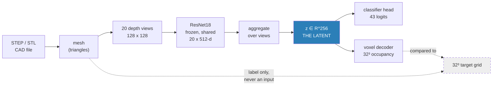
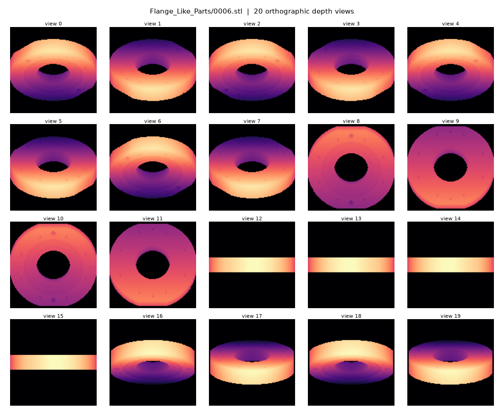
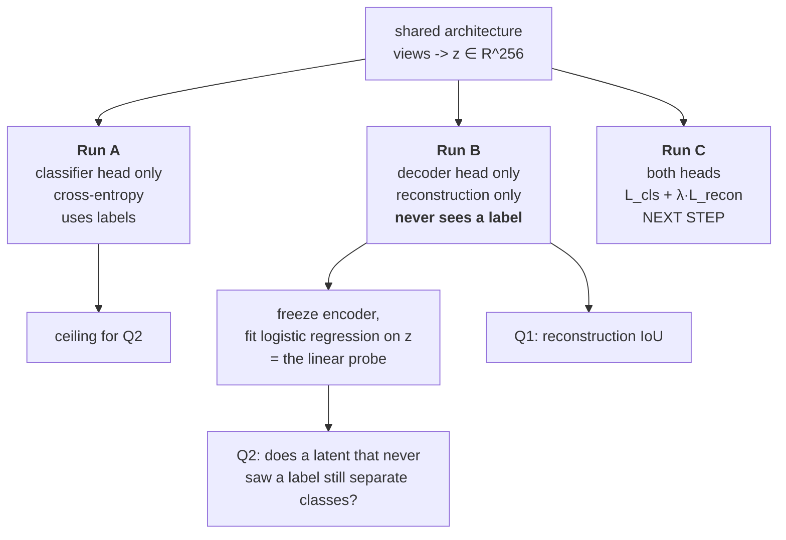
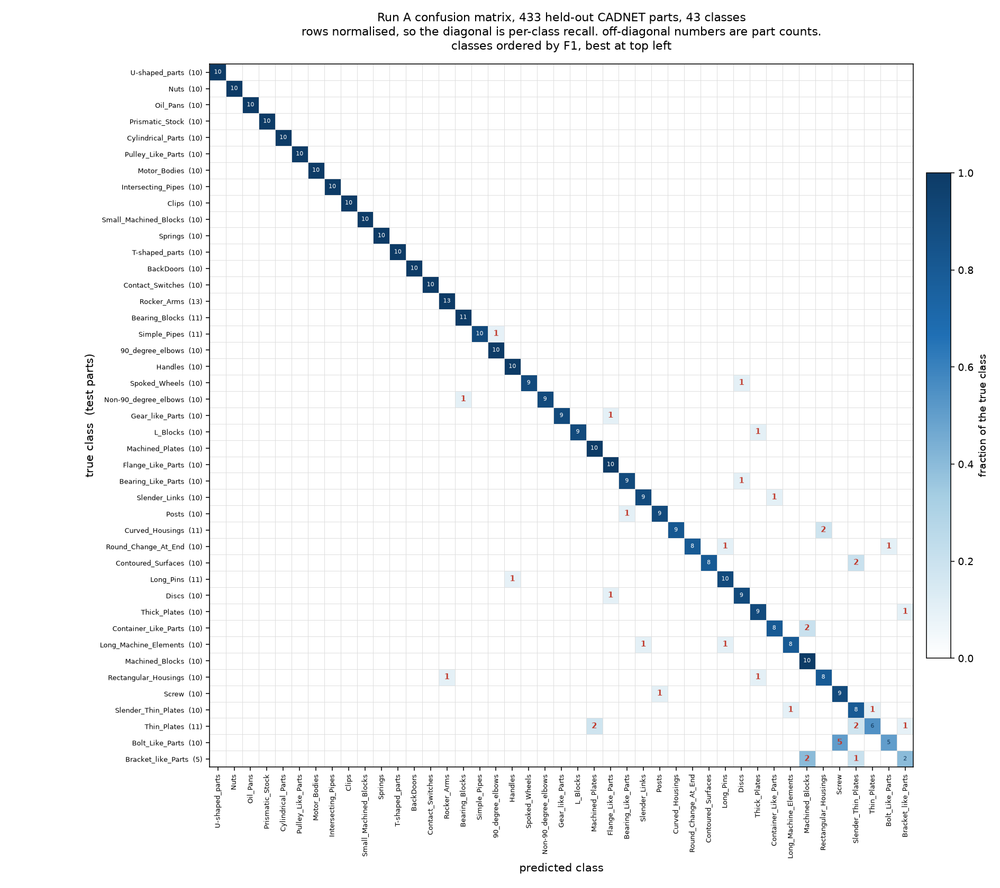
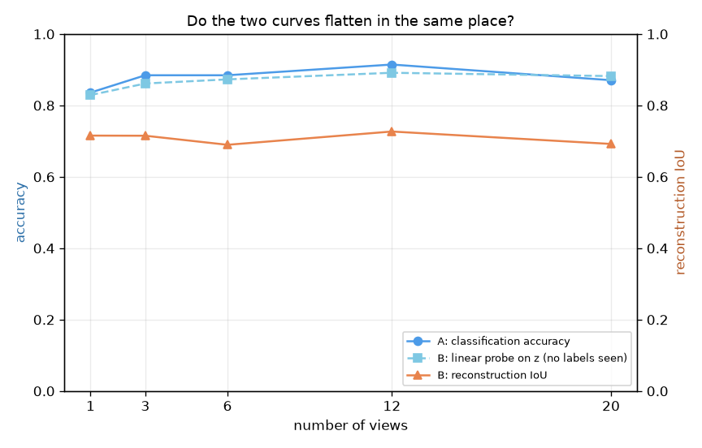
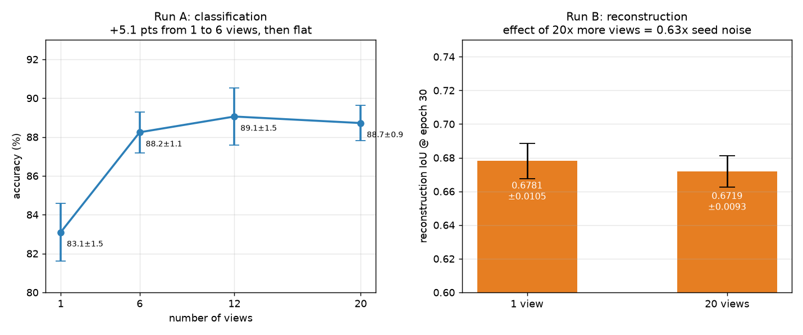
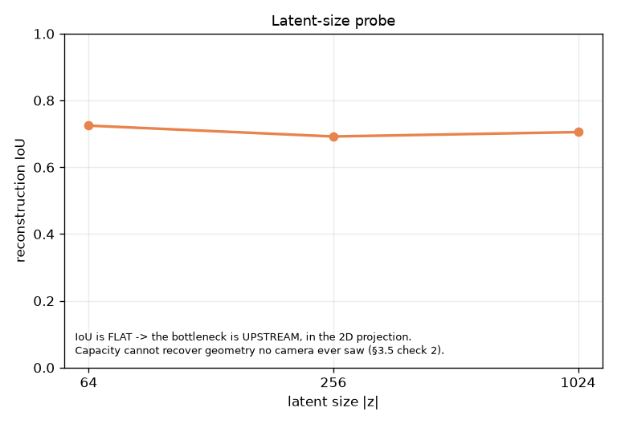
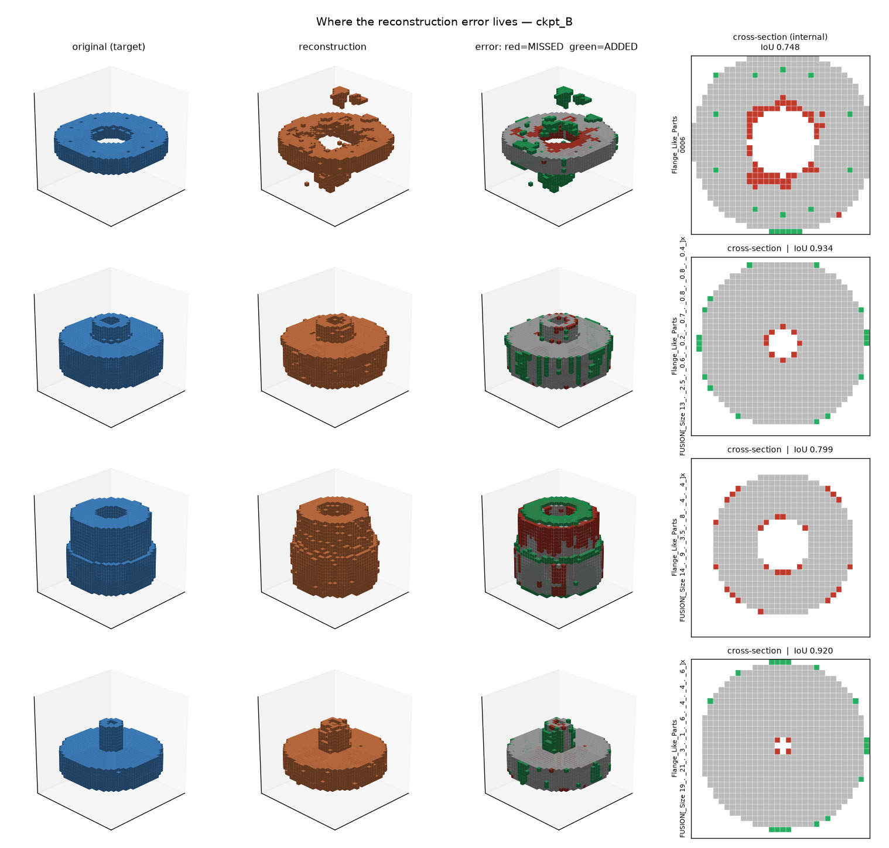
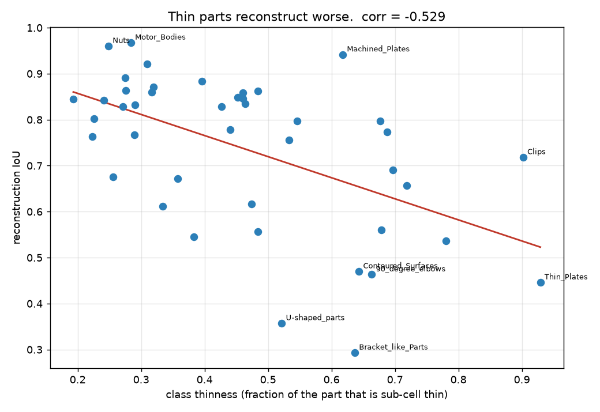

# Multi View Autoencoder

## Context

- Can a multiview encoder compress a 3D part into a latent vector and still give the geometry back when we decode it? 
- If it can, is that same latent good enough to classify the part? 
- And does training it to do both at once make either one better?




Experiment setup:

| | questions we are trying to answer | answered by |
|---|---|---|
| **Q1** | can we rebuild the 3D object from multiview images, and how well | Decoder's reconstruction IoU + the view sweep |
| **Q2** | can we classify parts from that same latent | Classification head training |
| **Q3** | does training both jointly help either one | Next step |

Observations:

1. Both heads read only the latent space `z` → classifier and decoder share `z` as input.
2. STEP file to Mesh → A STEP file is a B-rep (analytic surfaces) → not possible to feed convolution → we can render and query a mesh
3. Decoder outputs a 32³ voxel grid → chosen because it runs faster than querying a mesh
4. Voxelization choice: an exact voxelization output empty ofr almost all of thin plates and brackets, had to over-thick walls to fix this issue
5. Example: IoU at 0.55. Either the views genuinely do not contain the geometry OR decoder is too small, OR the latent too narrow, OR the voxel targets are misaligned, OR there is a bug in the loss. To rule out a problem with the decoder we memorising 20 grids with 7 M parameters and then eval on the 20 views → if IoU 1.0000 → all good


## Multiview input

The input is 20 grayscale depth images of the part, 128 x 128. Brighter = closer to the camera. The network has to reconstruct 3D geometry from these.




## The encoder

The backbone is ResNet18, ImageNet-pretrained, and frozen (to be able to train on ). 

- Trainable parameter count: **0.14 M** for the classifier arm (aggregator plus heads only,
because the backbone is frozen), **6.97 M** once the decoder is attached.

```
input   feats [B, 20, 512]        20 views, each already a 512-d ResNet18 vector
          |
          |  aggregate over the view axis      <- max-pool (MVCNN) or attention (GMViT-lite)
          v
        [B, 512]
          |
          |  Linear(512 -> 256)
          v
        [B, 256] the latent z
```

## The decoder

```
        [B, 256] the latent z
          |
          |  Linear(256 -> 256*4*4*4), reshape
          v
        [B, 256, 4, 4, 4]
          |  ConvTranspose3d + BatchNorm + ReLU     ->  [B, 128,  8,  8,  8]
          |  ConvTranspose3d + BatchNorm + ReLU     ->  [B,  64, 16, 16, 16]
          |  ConvTranspose3d                        ->  [B,   1, 32, 32, 32]
          v
   occupancy LOGITS [B, 32, 32, 32]
```

Simple architecture taken from 3D-R2N2 / Pix2Vox decoder shape from 2016 and 2019. 

### Problems encountered:
1. Model converges to a beautifully falling loss and a completely empty output. Solved by 
2. Resolution of the voxel grid : 32³ resolves bores down to about 6 mm on a 100 mm part. Threads, chamfers and fillets under about 3 mm
are not. We keep this in mind for now.
3. Number of views does not increase IoU on test set
4. Test set quantity per class if not high

### How to solve the problems:
1. Un freeze the encoder backbone
2. Swap the voxel decoder for an occupancy MLP
3. Joint training with joint objective ?


## Experiment Set Up

Three runs with same architecture -> they differ only in which heads exist and which
losses run, which is what makes the comparison mean anything.




## Results

All numbers below are CADNET, 2127 parts, 43 classes, 1694 train / 433 test, duplicate-aware split, seed 0.

### Accuracy results

Accuracy : top-1 argmax over the 43 logits, count the matches, divide by 433 test parts.

| run | trained accuracy | linear probe on z | reconstruction IoU |
|---|---|---|---|
| **A** classifier only | **91.0%** | 89.8% | n/a |
| **B** autoencoder only, *never saw a label* | n/a | **88.2%** | **0.743** |

| Classif head training, 433 test parts | precision | recall | F1 |
|---|---|---|---|
| **macro** (every class counts equally) | 91.3 | 90.4 | **90.3** |
| **weighted** (by class size) | 91.8 | 91.0 | 90.9 |


**Partial conclusions**:

- **IoU 0.743 from 20 depth views**.

- **a latent trained purely to reconstruct, which has never seen a single label, linear probes at 88.2%, which is 2.8 points behind the fully supervised one.** 

- ...

#### Per class, sorted worst first

- Classes are ordered by
F1, best at the top left, which is why the errors collect in the bottom right corner.
- 39 parts out of 433 are misclassified
- Bolt to Screw is the worst confusion




| class | precision | recall | F1 | test parts |
|---|---|---|---|---|
| **Bracket_like_Parts** | 50.0 | 40.0 | **44.4** | 5 |
| **Bolt_Like_Parts** | 83.3 | 50.0 | **62.5** | 10 |
| **Thin_Plates** | 85.7 | 54.5 | **66.7** | 11 |
| **Slender_Thin_Plates** | 61.5 | 80.0 | **69.6** | 10 |
| **Screw** | 64.3 | 90.0 | **75.0** | 10 |
| Rectangular_Housings | 80.0 | 80.0 | 80.0 | 10 |
| Machined_Blocks | 71.4 | 100.0 | 83.3 | 10 |
| Container_Like_Parts | 88.9 | 80.0 | 84.2 | 10 |
| Long_Machine_Elements | 88.9 | 80.0 | 84.2 | 10 |
| Discs | 81.8 | 90.0 | 85.7 | 10 |
| Thick_Plates | 81.8 | 90.0 | 85.7 | 10 |
| Long_Pins | 83.3 | 90.9 | 87.0 | 11 |
| Contoured_Surfaces | 100.0 | 80.0 | 88.9 | 10 |
| Round_Change_At_End | 100.0 | 80.0 | 88.9 | 10 |
| Bearing_Like_Parts | 90.0 | 90.0 | 90.0 | 10 |
| Curved_Housings | 100.0 | 81.8 | 90.0 | 11 |
| Posts | 90.0 | 90.0 | 90.0 | 10 |
| Slender_Links | 90.0 | 90.0 | 90.0 | 10 |
| Flange_Like_Parts | 83.3 | 100.0 | 90.9 | 10 |
| Machined_Plates | 83.3 | 100.0 | 90.9 | 10 |
| Gear_like_Parts | 100.0 | 90.0 | 94.7 | 10 |
| L_Blocks | 100.0 | 90.0 | 94.7 | 10 |
| Non-90_degree_elbows | 100.0 | 90.0 | 94.7 | 10 |
| Spoked_Wheels | 100.0 | 90.0 | 94.7 | 10 |
| 90_degree_elbows | 90.9 | 100.0 | 95.2 | 10 |
| Handles | 90.9 | 100.0 | 95.2 | 10 |
| Simple_Pipes | 100.0 | 90.9 | 95.2 | 11 |
| Bearing_Blocks | 91.7 | 100.0 | 95.7 | 11 |
| Rocker_Arms | 92.9 | 100.0 | 96.3 | 13 |
| BackDoors | 100.0 | 100.0 | 100.0 | 10 |
| Clips | 100.0 | 100.0 | 100.0 | 10 |
| Contact_Switches | 100.0 | 100.0 | 100.0 | 10 |
| Cylindrical_Parts | 100.0 | 100.0 | 100.0 | 10 |
| Intersecting_Pipes | 100.0 | 100.0 | 100.0 | 10 |
| Motor_Bodies | 100.0 | 100.0 | 100.0 | 10 |
| Nuts | 100.0 | 100.0 | 100.0 | 10 |
| Oil_Pans | 100.0 | 100.0 | 100.0 | 10 |
| Prismatic_Stock | 100.0 | 100.0 | 100.0 | 10 |
| Pulley_Like_Parts | 100.0 | 100.0 | 100.0 | 10 |
| Small_Machined_Blocks | 100.0 | 100.0 | 100.0 | 10 |
| Springs | 100.0 | 100.0 | 100.0 | 10 |
| T-shaped_parts | 100.0 | 100.0 | 100.0 | 10 |
| U-shaped_parts | 100.0 | 100.0 | 100.0 | 10 |

### View sweep

- Classification climbs and then saturates.
- Reconstruction is flat from the start -> maybe the decoder is doing some completion instead of of reconstruction






| | measurement |
|---|---|
| classification, 1 to 6 views | **+5.1 points**, then saturates. 6 / 12 / 20 are indistinguishable |
| classification seed noise | ±1.2 points |
| reconstruction, 1 to 20 views | **-0.0062 IoU** |
| reconstruction seed noise | ±0.0099 IoU |
| **effect / noise for reconstruction** | **0.63x. the effect is smaller than the noise** |

### Latent sweep

- the bottleneck does not seem to be the latent



| latent size | reconstruction IoU |
|---|---|
| 64 | 0.725 |
| 256 | 0.692 |
| 1024 | 0.705 |

- internal and external boundaries have reconstruction problems




### 9.6 The occlusion premise, tested rather than assumed

The original argument was that multiview loses internal geometry because cameras cannot see
inside. I tested that directly by marking a surface voxel visible if it survives the z-buffer
of at least one of the 20 cameras:

| | |
|---|---|
| surface occluded from **all 20** views | **0.2%** |
| error on visible surface | 20.4% |
| error on occluded surface | 25.3% (1.24x worse) |

**With 20 dodecahedral views, almost nothing on these parts is invisible.** Through-holes and
open pockets get seen from some angle. So 0.743 is not an occlusion limit.

Where the error does live, by depth into the material:

```
  depth from outer surface       error rate
  1 cell   (the boundary)   ####################  19.3%
  3 cells                   #####                  4.6%
  6 cells                   .                      0.0%

  surface voxels overall    #####################  20.4%
  interior voxels overall   ##########              9.6%
```

**Error lives at boundaries, not "inside".** My own first read of the error plot was that
error concentrates at internal features, and that was half wrong: the red ring around a bore
*is* a boundary, and bore walls are visible from some angle.

Two caveats I would state rather than bury. This is measured at 32³, where sub-cell features
do not exist to be occluded. And CADNET has very few genuinely *enclosed* cavities, which is
the real occlusion case. A part with a sealed internal void would probably behave differently.

### Which parts reconstruct the worst

- IoU is harsher on thin parts (one voxel shift can destroy something thin)


| best | IoU | | worst | IoU |
|---|---|---|---|---|
| Motor_Bodies | 0.967 | | Bracket_like_Parts | 0.293 |
| Nuts | 0.960 | | U-shaped_parts | 0.357 |
| Machined_Plates | 0.942 | | Thin_Plates | 0.446 |
| Flange_Like_Parts | 0.891 | | 90_degree_elbows | 0.463 |




TBC ...

## Appendix

| artifact | one-time cost | size |
|---|---|---|
| CADNET download, 3317 STL, 43 classes | minutes | 195 MB |
| feature + voxel cache, 2127 parts, 0 skipped | **33 min** | 35 MB |
| Run A (classifier, on cached features) | **6 seconds** | |
| Run B (autoencoder, 120 epochs) | 34 min | |
| overfit gate | 10 min | |
| view sweep + latent sweep, 13 runs | 2 h | |
| seed repeats, 36 runs | overnight | |


| | what we used | why we chose it |
|---|---|---|
| **dataset** | CADNET, 43 classes, capped at 50 parts per class = 2127 parts | real mechanical CAD |
| **split** | duplicate-aware, 1694 train / 433 test | CADNET is 19.3% duplicates. a random split leaks them and inflates every metric |
| **CAD to mesh** | tessellate with OCP / trimesh, watertight gate, 0 parts skipped | a B-rep has no fixed size or ordering, so a network cannot eat it. the mesh is what we can both render and query for containment |
| **input** | 20 orthographic depth maps, 128 x 128, cameras on a regular dodecahedron | depth carries geometry, RGB would only carry a lighting choice we invented. dodecahedron gives even angular coverage with no preferred axis. renderer written from scratch in numpy/torch, no pyrender or OSMesa |
| **encoder backbone** | ResNet18, ImageNet-pretrained, **frozen**, 512-d per view | same backbone GMViT uses. freezing lets us cache every per-view feature once (33 min), so a training run reads a 35 MB array and Run A trains in 6 seconds. that is what paid for the sweeps |
| **aggregation** | max-pool over views (MVCNN) or 1-query attention pool (GMViT-lite), ~40 lines | max-pool is the zero-parameter control arm. writing 5 lines we can explain beats making a research repo run |
| **latent** | `z ∈ R^256`, `Linear(512 -> 256)` | this is the number under test. if the latent were the bottleneck, 64 / 256 / 1024 should differ. it does not |
| **decoder** | `Linear` to 256 x 4³, then 3 x `ConvTranspose3d` + BatchNorm + ReLU, 6.97 M params | deliberately the standard 3D-R2N2 / Pix2Vox shape. a novel decoder would make the result impossible to attribute |
| **target** | 32³ conservative voxel grid | the format is dictated by what the decoder can emit (voxel grid is simpler for derivation) |
| **loss** | `BCEWithLogits`, `pos_weight = 11.1` | tricky to avoid empty reconstruction |
| **metric** | reconstruction IoU, plus a linear probe on frozen `z` | Loss can decrease for an empty reconstruction, IoU does not |
| **the gate** | memorise 20 parts, train and eval on the same 20 | tells "the views lost the geometry" apart from "my decoder is broken". we got **IoU 1.0000**, so 0.743 held out is a real limit |
| **runs** | A = classifier only, B = autoencoder only (no labels at all), C = joint | identical architecture in all three, only the heads and losses change. that is what makes the comparison mean anything |
