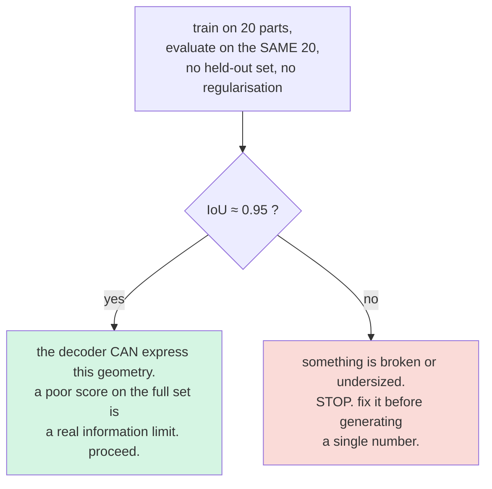

# NOTES — implementer's log

Surprises, deviations, and open questions. Per §18: if a design decision looks wrong,
it gets written here rather than silently changed.

---

## Progress against §17 build order

| # | Stage | Status | Artifact |
|---|---|---|---|
| 0 | Environment (conda env `mvae`) | ✅ done | see below |
| 1 | MPS smoke test | ✅ **PASS** | `results/smoke_mps.json` |
| 2 | `mesh.py` — load, normalize, watertight, voxelize | ✅ **PASS** | `results/stage2_*.png` + `.npy` |
| 3 | `render.py` — 20 depth-map views | ✅ **PASS** | `results/stage3_views_toilet.png` |
| 4 | `cache.py` — feature/voxel cache | ✅ **DONE** 2127 parts, 0 skipped | `cache_cadnet.npz` |
| 5 | `model.py` + `train.py` **Run A** | ✅ **91.0%** (43-way) | `results/run_A.json` |
| 6 | **Overfit gate** (§3.5) — IoU ≥ ~0.95 on 20 parts | ✅ **PASS 1.0000** on full cache | `results/run_gate.json` |
| 7 | `train.py` **Run B** | ✅ **IoU 0.743**, probe 88.2% | `results/run_B.json` |
| 8 | Sweeps — views {1,3,6,12,20}, latent {64,256,1024} | ✅ **DONE + noise floors** | plots 1 & 3 |
| 9 | Linear probe → the 2×2 table | ✅ **DONE** | `results/table.json` |
| 10 | `bench.py` — latency | ⬜ **NEXT** (5 min) | latency table |
| 11 | `demo.py` — STEP end to end | ⬜ needs `pip install cadquery-ocp` | view grid, recon, error map |
| 12 | **Run C** (Phase 2) | ⬜ | only if 1–11 clean |

---

## Glossary (terms used in this log)

- **MPS** — *Metal Performance Shaders*, Apple's GPU compute framework. In PyTorch,
  `torch.device("mps")` is the Apple Silicon equivalent of `cuda`: it runs tensors on the
  Mac's integrated GPU. This is what makes the §13 "no CUDA in the critical path"
  constraint satisfiable on a laptop. Its historical weakness is **op coverage** — some
  ops (notably 3D convolutions) were unimplemented or wrong on MPS, which is why §16
  makes the smoke test trap #1.
- **Watertight** — a mesh whose surface fully encloses a volume with no holes or gaps,
  so "inside" is well defined. Required for `.fill()` voxelization and for IoU to mean
  anything (§5).
- **IoU** — intersection over union of occupied voxels. The primary reconstruction metric.

---

## Stage 0 — Environment (day 1)

Conda env `mvae`, Python 3.11, on arm64 macOS 26.6.

| package | version |
|---|---|
| torch | 2.13.0 (MPS available) |
| torchvision | 0.28.0 |
| trimesh | 5.0.0 |
| numpy | 2.4.6 |
| scipy / scikit-learn / matplotlib | installed |
| **embreex** | 4.4.0 — **not optional**, see the voxelizer note below |
| rtree | 1.4.1 (trimesh spatial index) |
| pyglet | 1.5.31 (`<2`, for the interactive viewer only) |

Run everything with `/Users/rebecca.cervasio/miniconda3/envs/mvae/bin/python`, or
`conda activate mvae`.

**Editor note:** the IDE is reporting `Import "torch" could not be resolved`. That is the
editor pointing at the *base* conda env, not `mvae`. Select the `mvae` interpreter in the
IDE to clear it — it is not a code problem, the scripts run.

**CAD kernel (`cadquery` / OCP) is NOT installed yet** — deliberately deferred to its own
timeboxed step (§16 trap 7 budgets half a day). Blocks stage 11 (`demo.py`) only; stages
2–10 do not need it.

---

## Stage 1 — MPS smoke test (§17.1, §16 trap 1) — **PASS**

`python src/smoke_mps.py` → `results/smoke_mps.json`

The test builds the *actual* §15.4 decoder head (not a toy) and runs forward + backward.
`ConvTranspose3d` works correctly on MPS with torch 2.13.0: output shape
`(8,1,32,32,32)`, finite loss, finite gradients reaching the first `Linear`.
**No CPU fallback needed**; `config.decoder_device` stays `None`.

Two observations worth recording:

1. **First call on MPS costs ~207 ms of kernel compilation.** Every latency measurement
   (§15.7, `bench.py`) must warm up before timing or it will report compile time as
   inference time. The smoke test now warms up 5 iterations before timing.
2. **CPU is ~2× faster than MPS for this decoder** (85 ms vs 166 ms per fwd+bwd at
   batch 8). The decoder is small enough that MPS dispatch overhead dominates the actual
   compute. Not acting on this now (§18: don't optimize before measuring), but it means
   the device choice is worth revisiting at stage 10 (`bench.py`) rather than assumed.

---

## The demo STEP file (§6) — inspected, not yet loaded

`resources/500-1212.step`, 1.2 MB, **STEP AP242 Edition 2** (ST-Developer / STEP Tools),
timestamped 2026-04-06. Read as plain text — no CAD kernel needed for this.

| entity | count |
|---|---|
| `MANIFOLD_SOLID_BREP` | **37** |
| `PRODUCT` | 41 |
| `ADVANCED_FACE` | 695 |
| `CYLINDRICAL_SURFACE` | **200** |
| `PLANE` | 359 |

Three things this tells us:

1. **It is an assembly, not a single part** — 37 solids. §6 step 2 ("split into solids if
   it's an assembly") is not optional, it is the main path. `demo.py` must loop over parts.
2. **200 cylindrical surfaces** means it is bore- and fastener-heavy. This is exactly the
   geometry §0.5 plot 2 wants — the internal features the multiview projection cannot see.
   The demo file is a better argument for the occlusion thesis than a dataset model.
3. `MANIFOLD_SOLID_BREP` is the good case for watertightness — manifold B-reps should
   tessellate to closed meshes, so the §5 gate has a decent chance of passing here.

Still unverified until the CAD kernel is installed: whether OCC tessellates all 37 cleanly.

---

## Stage 2 — `mesh.py` (§17.2, §15.1, §15.3) — **PASS**

`python src/mesh.py <mesh> [out.png]` → `.npy` of shape exactly `(32,32,32)` + 3-view voxel plot.
Verified on `toilet_0002` (tank, bowl and rounded top-down outline all clearly correct).

`normalize()` lives here and nowhere else (§15.1). Isotropic, centred on the bounding-box
centroid, furthest vertex at r=1. Note this puts the object inside the unit **sphere**, so
it does not touch the cube faces — expected, not a bug.

### Deviation 1: voxel alignment by world coordinates, not centre-cropping

§15.3 says pad/centre-crop trimesh's matrix to 32³. Implemented instead as: map trimesh's
occupied cell **centres** (world coords) into our own fixed lattice spanning `[-1,1]³`.
Same fixed shape and the shape is still asserted, but alignment is *derived* rather than
assumed. Reason: trimesh anchors its grid on the mesh bounds, not the origin, so
centre-cropping can silently shift voxel targets relative to the rendered views — §16
trap 2 exactly, and invisible in the loss.

### Deviation 2: `.fill()` is NOT the voxelizer. It inflates every target by 12–19%.

Two problems with the literal §15.3 route, found by checking it against ground truth:

1. **Watertightness is worse than assumed.** Measured on ModelNet10 (150 meshes, 15 per
   class): **4.0% watertight as loaded, 10.0% after repair.** `.fill()` needs watertight.
2. **`.fill()` systematically dilates.** trimesh marks every cell the surface *passes
   through*, so a solid comes out about one cell too fat in every direction. Checked
   against **analytic volumes**:

   | shape | `surface_fill` error | `exact` error |
   |---|---|---|
   | box 1.4×0.8×1.0 | **+18.6%** | **+0.1%** |
   | cylinder r0.8 h1.2 | +19.0% | +6.0% (real 32³ discretization of a curved wall) |
   | sphere r1 | +12.0% | +0.6% |

   On `toilet_0002` it inflated occupancy by **69%** (2316 cells vs 1368 true).
   This is not cosmetic: dilation grows solid material *inward*, shrinking exactly the
   bores and internal voids this project exists to measure.

**So `voxelize()` now has three routes and defaults to `exact`.** It takes `method="auto"`
and **returns the method it used** (§18: no silent fallbacks; `cache.py` records it per part):

- **`exact`** *(primary)* — point-in-solid test at each of our lattice centres: "is this
  cell's centre inside the part?" Unambiguous, and it queries **our** lattice directly, so
  there is no re-binning drift at all. Needs watertight (ray-parity test).
- `surface_fill` — the §15.3 route. Kept for comparison only, **not** for targets.
- `morphological` — surface-voxelize then `binary_fill_holes`; the fallback for meshes
  that fail the gate. Inherits the dilation, but needs no watertight surface.

**This is why `embreex` is a hard dependency.** Exact containment is a ray-parity test, and
without embreex trimesh falls back to a pure-Python intersector: **7.63 s per part vs
0.02 s** — 380×, the difference between 4 hours and 40 seconds for 2000 parts. With it,
the *correct* method is also the cheap one.

**Validated:** volume within +0.1%/+0.6% of analytic truth (above); centroid alignment to
mesh **0.0000** and bounds within half a cell; bores stay OPEN at every size tested down to
1.6 cells across; view↔voxel silhouette agreement *improved* (0.861 → 0.890).

### The cost of `exact`: sub-cell features vanish

Exact containment drops anything thinner than one cell, where dilation kept it (too fat).
Plate of thickness *t*, at 32³:

| cells thick | ≈mm on a 100 mm part | `exact` | `morphological` |
|---|---|---|---|
| 1.13 | 4.0 mm | 968 cells | 1587 cells |
| **0.85** | **3.0 mm** | **GONE** | 529 cells |
| 0.28 | 1.0 mm | **GONE** | 529 cells |

Neither is right — at 32³ a sub-cell feature is unrepresentable. `exact` is still the
correct default because it is unbiased *above* the resolution limit (+0.1%) while dilation
is biased *everywhere* (+12–19%). **Action for stage 4: flag thin-walled parts at cache
time** (compare `exact` vs `surface_fill` occupancy per part) and report the count, rather
than silently shipping targets with missing walls. This is also the strongest argument for
64³ if the CAD set turns out to be sheet-metal heavy.

### But the honest result: the fallback does NOT rescue ModelNet10

Morphological fill returns *identical* occupancy to `surface_fill` on real ModelNet meshes
(~1.6–4%). The shells have gaps, so the interior is connected to the exterior and there is
no enclosed region to fill. Morphological **closing** (dilate → fill → erode) was also
tested and moved the number by ≤0.2pp. Neither helps.

The reason is that ModelNet furniture is genuinely thin-walled. Filling measured across
watertight meshes:

| geometry | what filling adds |
|---|---|
| ModelNet furniture (thin plates) | **0 to +7pp**, frequently exactly 0 |
| chunky solids — box, cylinder | **+14 to +26pp** |

**Consequence, and it is the important one:** watertightness barely matters on ModelNet
(shell ≈ solid at 32³ for thin geometry) but matters *enormously* for real CAD parts,
which are chunky solids. ModelNet debugging is unaffected — its targets are self-consistent
between train and eval, so the overfit gate and IoU still behave — but **stage 4 must gate
hard on watertightness for the CAD dataset**, or targets silently lose a quarter of their
volume and every reconstruction number is wrong in a way that looks like a research finding.

Not pursuing ModelNet watertightness further: §5 makes it debug-only and no ModelNet number
gets reported, so fixing it would be a rabbit hole with no effect on any deliverable.

---

## Stage 3 — `render.py` (§17.3, §15.2, §4 plan A) — **PASS**

`python src/render.py <mesh> [out.png]` → `[20,128,128]` float32 + a 4×5 view grid.
`results/stage3_views_toilet.png` is visibly one object from 20 angles: side profiles,
top-down bowl outline, smooth depth gradients, **no speckle** (the 3×3 splat works).

Pure numpy/torch as specified — no pyrender, no PyTorch3D, no OSMesa. §10 ranked this the
#1 risk to the week; it took one pass. The z-buffer is a `torch.scatter_reduce_(reduce="amin")`,
which is fast enough that no optimization is warranted (§18).

### Verified, not eyeballed

Eyeballing a depth map cannot catch a sign error or a misalignment, so:

| check | result |
|---|---|
| 20 cameras on the unit sphere | all NN distances equal (0.7136), exactly 3 neighbours each → a genuine **regular dodecahedron**; centroid at origin |
| `look_at` | orthonormal, **det = +1** (proper rotation, no reflection); camera→origin maps to **+z**; degenerate poles `(0,0,±1)` handled |
| **depth polarity** | two spheres on the view axis: nearest surface depth 0.003, farthest 0.109 → **smaller z = nearer**, as §15.2 requires |
| **views ↔ voxels agree** (trap 2) | silhouette IoU **0.84–0.97** across all 20 cameras on cylinder/box/bored-annulus/icosphere/toilet |
| determinism (trap 8) | same seed → bit-identical; different seed → resampling noise only |
| view subsets | N ∈ {1,3,6,12} render **bit-identically to those slices of the 20** |
| throughput | 0.55 s/part → **~18 min for 2000 parts**, matching the §3.4 estimate |

The subset result is the load-bearing one: it confirms §15.5's claim that the view-count
sweep is just slicing cached `feats` along axis 1, with **no re-rendering and no
re-encoding**. That is what makes the §0.5 sweep affordable on a laptop.

### A note on the trap-2 test itself

The first version of that test reported IoU ≈ 0.06 and looked like a serious failure. It
was the *test* that was wrong: each voxel centre projects to a single pixel, so it compared
~1024 scattered points against ~10,000 contiguous ones. The tell was that the number was
*identical* (0.061) for three very different shapes. Corrected by comparing both silhouettes
at a matched 32×32. Recording it because the same mistake would misread a real result: a
number that barely moves across genuinely different inputs is measuring the harness, not
the object.

### Not done here (deliberate)

The occlusion demonstration — showing a bore is invisible from all but the axial views —
is the natural artifact of this stage, but it belongs to §0.5 plot 2 at stage 8. Noted so
it does not get forgotten; not built now, per §18 "get end-to-end before deep on any stage."

---

## Is 32³ actually enough? (measured, not assumed)

Prompted by a fair challenge: *"if we voxelize, aren't we losing the shape we were trying
to capture?"* Worth answering with numbers, because Sai can ask the same thing.

**First, the framing correction (§3.3).** The voxel grid is a **label, not an input**. The
network only ever sees the 20 images. Voxelizing therefore does not remove information from
the pipeline — it sets a **ceiling on what the measurement can detect**, and it applies
equally to the ground truth and the prediction, so it caps the *resolution* of the answer
rather than biasing the comparison.

**Second, the size of that ceiling.** `python src/viewmesh.py <mesh>` renders
original mesh | 32³ | 64³ | 128³ through the same camera (`results/voxcompare_*.png`):

| resolution | cell size | ≈mm on a 100 mm part | silhouette IoU vs true mesh |
|---|---|---|---|
| **32³** | 0.0625 | **3.1 mm** | 0.890 |
| 64³ | 0.0312 | 1.6 mm | 0.941 |
| 128³ | 0.0156 | 0.8 mm | 0.966 |

At 32³ the object is still plainly the object; what is gone is sub-3mm surface detail.

**Third, the question that actually matters — do bores survive?** Probing the central axis
column of a bored annulus across bore sizes:

| bore dia | ≈mm | cells across | 32³ | 64³ |
|---|---|---|---|---|
| 0.103 | 6 mm | 1.6 | **OPEN** | OPEN |
| 0.171 | 10 mm | 2.7 | **OPEN** | OPEN |
| 0.343 | 20 mm | 5.5 | **OPEN** | OPEN |
| 0.772 | 45 mm | 12.3 | **OPEN** | OPEN |

**Conclusion: 32³ resolves bores down to ~6 mm on a 100 mm part.** The internal geometry the
occlusion argument is about is therefore measurable at 32³; threads, chamfers and fillets
under ~3 mm are not. That is the precise scope of the claim the week can support, and it
should be stated in the meeting rather than waiting to be asked.

Keeps §2's plan intact: if IoU looks great at 32³, bump to 64³ and watch it degrade — the
degradation is the finding. §3.2's occupancy/SDF MLP remains the resolution-free upgrade.

*(A first version of the bore test reported non-monotonic nonsense — a 45mm bore vanishing
while a 30mm one survived — because the probe window scaled with the bore radius and sampled
into solid material. Same lesson as the stage 3 test bug: check that a result is monotonic
in the thing you varied before believing it.)*

---

## "Why voxelize the label at all — why not compare against the mesh?"

Second fair challenge, worth writing down because it has a real answer *and* a real
concession.

**The label format is not chosen independently — it is dictated by the decoder's output.**
A network emits a fixed-size tensor of floats. A mesh is variable-length, has integer face
connectivity, and its topology is not differentiable (no gradient turns 900 triangles into
1200). So the decoder cannot emit a mesh, and whatever it *does* emit defines the space the
comparison happens in. The label must live in that space.

| decoder emits | label needed | mesh used directly? |
|---|---|---|
| 32³ voxel grid | 32³ grid | no — precomputed once |
| **occupancy MLP** `f(z,x,y,z)` | **"is this point inside?"** | **yes — queried live** |
| point cloud N×3 | surface samples | yes, but no volume → no IoU (§3.2) |
| mesh deformation | the surface | yes, but fixed topology → bores fail (§3.2) |

**So yes, the mesh CAN be the label — that is the §3.2 occupancy route**, where you sample
points in the cube and ask the mesh "inside or outside?" No grid is ever built, and it is
resolution-free: one trained model evaluates at 32³ *or* 128³ with no retraining.

**Measured cost, now that embreex is in:**

| | per call | note |
|---|---|---|
| live mesh query, 2048 pts | **3.8 ms** | ≈120 ms per batch of 32; ≈8 min over a 60-epoch run |
| cached 32³ grid | **0.013 ms** | 300× faster; 62.5 MB for 2000 parts (500 MB at 64³) |

**Decision: voxels stay for this week.** Not because the mesh route is wrong, but because
§3.4's caching is what makes the week fit — runs drop to under a minute, and that is what
funds the §0.5 view sweep and latent sweep. Live queries reload meshes and re-pay the label
cost on every run, breaking exactly that property.

**Also worth knowing: IoU needs a discretized volume regardless.** Even with an occupancy
decoder you evaluate it *on a grid* to report IoU — volumetric overlap has to be measured
somewhere. Voxels reappear at evaluation time either way; the occupancy route just lets you
choose the resolution after training instead of before.

**One revision to §3.2:** it calls the occupancy MLP an upgrade "if day 4 goes fast." With
fast exact containment now built (`mesh.lattice_centres` + `ray.contains_points`), the
switch is cheaper than that framing assumes — a real option, not a stretch goal. Keeping the
decoder behind a clean interface so it stays a one-class swap, as §3.2 asks.

---

## The voxel-definition decision (CADNET) — and a correction to my own earlier call

### The problem

CADNET downloaded cleanly (194.7 MB, 43 classes, 3317 STL, public Google Drive, no form).
It is **95.0% watertight as loaded, 97.3% after repair** — far better than ModelNet10's 4%.

But with `exact` voxelization at 32³, **7.5% of parts produce a completely EMPTY grid**, and
the failure is **class-correlated**, which is far worse than a random defect:

| class | exact EMPTY | conservative EMPTY |
|---|---|---|
| Thin_Plates | **80–100%** | 0% |
| Slender_Thin_Plates | 60% | 0% |
| Clips | 60% | 0% |
| Bracket_like_Parts | 40% | 0% |
| Machined_Plates | 30% | 0% |
| **all 43 classes** | **7.5%** | **0.0%** |

An empty target trains the decoder to output nothing and yields a meaningless IoU that still
enters the average. That is the §0.4 failure — a broken instrument reported as a finding.

### What the two definitions are

- **exact** — cell ON if its **centre** is inside the solid. True volume (+0.1% vs analytic),
  but a feature thinner than one cell contains no centre and vanishes entirely.
- **conservative** — exact, plus any cell the **surface passes through**. One extra ring of
  cells (+12–25% volume), and nothing can ever vanish.

`src/voxcompare.py <mesh>` renders both with the true mesh cross-section overlaid in red —
the only view where the difference is unambiguous. See `results/voxdef_Thin_Plates.png`
(exact = 0 cells, the part is deleted) and `results/voxdef_Flange_Like_Parts.png` (exact
fragments the flange rim).

### Correcting two things I got wrong

1. **"Dilation shrinks bores."** Measured: false at 32³. exact and conservative close the
   bore at the *same* size (4 mm / 1.10 cells) and both keep it open at 6 mm+. The
   resolution limit binds first, identically for both. Dilation costs nothing on bores here.
2. **"exact is the correct default."** It is not what the field does. `binvox` — the
   standard voxelizer used by **3D-R2N2, Pix2Vox and ShapeNet**, i.e. the exact lineage
   §3.6 cites — has `-e` (*"sets any voxel with part of a triangle"*, conservative) and
   `-dc` **dilated carving**, which *"stops carving 1 voxel before intersection, which helps
   with thin wall preservation"*. ShapeNet's official solid voxelizations use
   `binvox -aw -dc -pb`, and the documented tradeoff is that *"walls may be extra thick."*
   **Deliberately over-thickening walls rather than losing them is standard practice.**

### Decision

**`conservative` at 32³.** Loses no parts, matches field practice, preserves bores
identically to exact, and keeps 32³'s speed (64³ is 3.2× slower per step and 829 MB of
cache, which would consume the days §9 reserves as slack for Phase 2).

**State in the meeting:** reported IoU is against a slightly inflated target (~+15%
volume), which is fine for comparing runs — target and prediction share one definition —
but it means no claim of the form "reconstructed volume equals true volume." 64³ remains
the §2 degradation experiment.

### Exactly how `conservative` relates to binvox

`binvox` is the standard voxelizer behind 3D-R2N2 / Pix2Vox / ShapeNet. Its modes:

| binvox mode | produces |
|---|---|
| `-e` (exact, Eric Haines) | **surface** — any voxel a triangle passes through |
| carving `-c` / `-dc` | surface, z-buffer; `-dc` stops 1 voxel early to preserve thin walls |
| parity count / ray stabbing | **solid** interior |
| ShapeNet's `-aw -dc -pb` | `-aw` = *"renders the model in wireframe for thin parts"* + dilated carving |

**Our `conservative` = `-e` ∪ parity-solid** — the same definition, assembled from trimesh.
Definitionally equivalent; **not** verified bit-exact against binvox.

**binvox cannot be run here.** Downloaded and tried: it is a Mach-O **x86_64** GLUT program
and fails at load with `Library not loaded: /opt/X11/lib/libglut.3.dylib` — it needs
**XQuartz**. That is exactly the §13 prohibition ("No pyrender, no OSMesa, no EGL... the
single most likely way to lose two days"). Even `-e` cannot run, because the binary links
GLUT at load time regardless of mode.

*Optional, if hard literature parity is wanted:* `brew install --cask xquartz` once, run
binvox `-e` on ~20 parts, record IoU vs our `conservative`. **Validation only, never a
pipeline dependency.** ~30 min. Not done yet.

### Verified: what dilation actually does to thin parts

`python src/thincheck.py [class]` → `results/thin_gallery.png`. Wall thickness measured by
**contiguous run length** through each occupied cell (validated exact against synthetic
slabs of 1/2/3/5 cells).

*(First attempt used `2*max(distance_transform_edt)`, which reports 2.0 for a 1-cell AND a
2-cell plate — every cell of both touches empty space, so it structurally cannot tell them
apart. It claimed a 0.21-cell plate became "2.0 cells" i.e. 10× over-dilated, which would
have pointed at the wrong conclusion. Third measurement bug this project; the tell each time
was a number that did not respond sensibly to the thing being varied.)*

| true wall thickness | `exact` | `conservative` | over-dilation |
|---|---|---|---|
| 0.21 – 0.71 cells | **EMPTY** | **1 cell** | **1.0× — the minimum a grid can represent** |
| 1.13 – 1.69 cells | 2 cells | **3 cells** | **up to 3.0× — worst case** |
| 2.82+ cells | 2–4 cells | 3–5 cells | ~1.0–1.2× |

Real CADNET, median wall thickness in cells (∅ = parts exact loses entirely):

| class | exact | conservative |
|---|---|---|
| Thin_Plates | – (6∅) | 1.0 |
| Slender_Thin_Plates | 1.0 (4∅) | 1.2 |
| Clips | 3.0 (3∅) | 2.5 |
| Flange_Like_Parts | 5.2 | 6.0 |
| Nuts | 6.0 | 8.0 |

**Conclusion: dilation adds at most one cell per face.** Sub-cell features get 1 cell, which
is unavoidable; the ~2-cell regime is the worst relative case (+50%); thick parts inflate
~+33% (Nuts 6→8). Visually the conservative grids stay faithful — clips read as clips,
plates as plates — while `exact` deletes 4 of the 6 parts in the gallery outright.

`shell ∪ interior`, `surface_fill` and `morphological` were measured to give **identical**
thickness on every case, so the three are interchangeable; the choice among them is
cosmetic.

### Subsetting: the rule, and a mistake I made

**A subset is safe when the selection rule is independent of the geometry, and unsafe when
it correlates with the thing being measured.**

I first recommended "the 10 largest classes" for speed and called it unbiased. **It is not.**
Measured across all 43 classes:

| | mean thinness |
|---|---|
| 10 largest classes | **0.407** |
| other 33 | **0.520** |

correlation(class size, thinness) = **−0.211**. Larger classes are systematically chunkier,
so taking the top 10 excludes *every* thin class — Slender_Thin_Plates (0.97), Thin_Plates
(0.93), Bracket_like_Parts (0.81), Rectangular_Housings (0.75). That is the same bias I had
just argued against, arriving through the back door. Caught by the researcher, not by me.

**The fix: keep all 43 classes, cap parts per class.** A uniform cap is blind to geometry.

| cap/class | parts | per run | 13 sweep runs |
|---|---|---|---|
| 30 | 1287 | 11 min | 2.5 h |
| **50** | **2127** | **19 min** | **4.1 h** |
| none | 3317 | 29 min | 6.4 h |

**Chosen: all 43 classes, cap 50 ≈ 2127 parts** — hits §5's "~2000 parts", keeps CADNET's
full taxonomy (so accuracy is comparable to CADNET's own 43-class paper), no thin-class bias.

*(Selecting by voxelizability — "only the classes we can voxelize" — fails the same test
even more directly, and §18 forbids it: "a quiet try/except that drops 30% of the dataset
will read as a research finding." Moot anyway, since conservative handles every class.)*

### MCB — not verified

MCB is distributed only via **Box links requiring a browser** (JS-rendered; fetch returns an
empty shell) with no HuggingFace mirror, so it could not be checked programmatically. Not
expected to change the decision: the thin-part problem is intrinsic to mechanical CAD at
32³, and MCB aggregates TraceParts/3DWarehouse/GrabCAD (washers, springs, sheet metal),
so it should be the same or worse. CADNET already incorporates ESB and NDR.

---

## Tools for looking at things (not pipeline code)

Both live in `src/` but neither is imported by the pipeline.

**`viz.py` — interactive 3D window** (needs `pyglet<2`):

```bash
python src/viz.py <mesh>                    # spin a mesh around
python src/viz.py <mesh> --voxels           # mesh | 32³ voxels side by side
python src/viz.py <mesh> --voxels --res 64  # ...at another resolution
python src/viz.py <mesh> --cameras          # the 20 dodecahedron viewpoints, in place
python src/viz.py --cls toilet --n 4        # browse a ModelNet10 class
python src/viz.py <mesh> --save out.png     # build the scene headless, save a PNG
```

Controls: drag rotate · scroll zoom · shift-drag pan · `w` wireframe · `a` axes · `z` reset
· `q` quit. The `--cameras` mode draws the 20 viewpoints as dots with stalks pointing at
the object — the fastest way to make the multiview setup legible to someone.

Voxel boxes are placed on the **same** `[-1,1]³` lattice `mesh.py` uses, so if voxels and
mesh ever look misaligned in this window, that is a real bug and not a display artifact.

**`viewmesh.py` — headless "what does voxelizing cost"**: renders
original | 32³ | 64³ | 128³ through one camera and prints cell size, mm-on-a-100mm-part,
and silhouette IoU. This is what produced the resolution table above.

---

## Stages 4–7 — cache, model, training

### Datasets on disk

| dataset | size | contents | status |
|---|---|---|---|
| ModelNet10 | 360 MB | 10 classes, `.off` | pipeline debugging only (§5 tier 1) |
| **CADNET_3317** | 195 MB | **43 classes, 3317 `.stl`** | **the working set** |
| MCB_A | 2.4 GB | 58,835 `.obj`, train/test split | downloaded, unused this week |
| MCB_B | 1.7 GB | 18,091 `.obj`, train/test split | downloaded, unused this week |

MCB is available but not used: §5 makes MCB-B the fallback "if CADNET's watertightness is
poor", and CADNET is 95–97% watertight, so the condition never triggered. §8 excludes full
MCB-A regardless. Both archives are on disk for week 2.

### `cache.py` (§15.5)

`python src/cache.py --dataset cadnet --limit 50` → `data/cache_cadnet.npz` +
`cache_cadnet_report.json`. **43 classes, cap 50/class = 2127 parts.** Rate ~0.86 parts/s,
so ~40 min one time. Stores `feats [N,20,512] float16`, `voxels [N,32,32,32] bool`,
`labels`, `ids`, `classes`, plus per-part provenance (voxel method, watertight verdict,
thin-wall ratio) and the §5 pass rates.

`pos_weight` (§15.6) is computed from the data and written to the report — on the 86-part
smoke build it came out **12.6**, inside §15.6's expected 10–20× range.

**Known cosmetic issue:** the build logs `[voxelize] WARNING: zero occupied cells` for some
parts. That is the *thin-wall diagnostic* computing `exact` on purpose, not the stored
target — `kept=N skipped=0` throughout. Misleading log line, to be silenced.

### `model.py` (§15.4)

`MVAE` = aggregator (`max` MVCNN / `attn` GMViT-lite, ~5 lines) → `Linear(512, latent)` →
heads. Runs A/B/C differ only in which heads exist and which losses run; the architecture
is identical (§3.3). `VoxelDecoder` is behind an interface so the occupancy/SDF MLP stays a
one-class swap (§3.2), and already supports `res=64`.

Trainable: **0.14 M** for run A (aggregator + heads only — the backbone is frozen and
cached), **6.97 M** with the decoder.

### `train.py` — smoke-tested on the 86-part cache

- **Run A** converges: acc 4.7% → 67.4% over 12 epochs, probe 72.1%.
- **Run B** converges: IoU 0.11 → 0.21 over 15 epochs, **loss falling *and* IoU rising**,
  so `pos_weight` is working and it is not collapsing to empty.
- **Overfit gate (§17.6, §3.5): PASS at IoU 0.9986** on 20 parts / 200 epochs.
  The decoder can express this geometry, so a poor IoU on the full set is a real
  information limit and not an engineering failure. **Must be re-run on the full cache.**

### Measured: CPU is 2.4× faster than MPS for training

| device | 40 epochs, 20 parts | final IoU |
|---|---|---|
| mps | 25.7 s | 0.5247 |
| **cpu** | **10.7 s** | 0.5255 |

Same result to 3 decimals, 2.4× the speed — the decoder is small enough that MPS dispatch
overhead dominates, exactly as the stage-1 smoke test suggested. **`train.py` now defaults
to `--device cpu`**; cache building stays on MPS, where ResNet18 wins. Across the §0.5
sweeps this is roughly 4.7 h → 2 h. Measured before changing anything, per §18.

Also added: `--eval-every` (default 5). Evaluating the full test set every epoch was a
large share of runtime and changes no result.

---

## CADNET contains duplicates, and a random split leaks them — caught before reporting

**The first Run A returned 92.9% (43-class) with a 94.1% linear probe. That number was not
real.** Four checks, run because 76% after a single epoch was suspiciously fast:

| check | random split | duplicate-aware split |
|---|---|---|
| parts sharing an **identical** 32³ grid | **17.5%** | — |
| test parts with a train neighbour at cos > 0.999 | **17.9%** | **1.4%** |
| **1-nearest-neighbour accuracy** | **95.5%** | 91.0% |
| Run A accuracy | 92.9% | **91.0%** |
| linear probe | 94.1% | **89.8%** |

**The decisive signal: 1-NN retrieval scored 95.5%, HIGHER than the trained model.** When a
trivial retrieval baseline beats the model, the task is not classification — it is "find the
copy you already saw." Worst offenders sit at cosine **1.0000** (`0027`/`0028`,
`0019`/`00191`).

### What the duplicates actually are

Inspected the original pre-normalization bounding boxes of 220 duplicate groups:
**86% are true duplicates** — same size, same geometry, different filename. CADNET ships
repeated models. The remaining **14% are scale variants** collapsed by our normalization
(one group spans a 1000× size ratio), which is §3.7's invariance conflict appearing in the
data: normalizing to the unit sphere destroys absolute scale, so an M6 and an M8 bolt become
the *same input*. Worth raising with Sai — it is exactly the good-recall/bad-precision
signature, visible in our own pipeline.

### The fix

`train.py` now builds duplicate groups (identical voxel grid **OR** pooled-feature cosine
≥ 0.999) as connected components, and assigns **whole groups** to one side of the split.
**1716 groups from 2127 parts — 411 duplicates, 19.3%.** On by default; `--no-dedup`
disables it and is labelled as inflating every metric.

The 0.999 threshold is deliberately strict: genuinely distinct parts sit around 0.99
(all bolts look alike), so a looser threshold would collapse whole classes.

**This mattered more for Q1 than Q2.** An inflated accuracy is embarrassing; an inflated
reconstruction IoU would have been reported as evidence about what the projection preserves,
which is the §0.4 failure in its exact form.

### Report the 1-NN baseline alongside the model

Even on the clean split, **1-NN scores 91.0% — identical to trained Run A.** That is not
leakage; it says frozen ImageNet features plus max-pooling are already near-separable for
CADNET's 43 classes, and a trained linear head adds essentially nothing. An honest baseline
to show rather than hide, and it sharpens what Q2 is really asking.

---

## Results so far (CADNET, 2127 parts, 43 classes, duplicate-aware split)

| | value |
|---|---|
| cache | 2127 parts, **0 skipped**, 35 MB, 33 min |
| watertight as loaded / after repair | **88.6% / 89.4%** |
| voxel methods | conservative 1901 · morphological 226 |
| `pos_weight` | **11.1** |
| parts existing only via dilation | 6.2% |
| **Run A** accuracy (43-way) | **91.0%** |
| Run A linear probe | 89.8% |
| 1-NN baseline | 91.0% |
| **overfit gate (§3.5)** | **IoU 1.0000 — PASS** |

Run A trains in **6 seconds** on cached features, which is what §3.4 bought.

---

## RESULTS — Q1 and Q2 answered (CADNET, 2127 parts, 43 classes, dedup split)

### The latent table (§0.5 artifact 3)

| run | trained acc | linear probe | recon IoU |
|---|---|---|---|
| **A** — classifier only | **91.0%** | 89.8% | — |
| **B** — autoencoder only, *never saw a label* | — | **88.2%** | **0.743** |
| C — joint | not run (Phase 2) | | |

**Q1: held-out IoU 0.743** from 20 depth views. The overfit gate reached **1.0000**, so this
is a real information limit, not decoder capacity — §0.4's ambiguity is closed.

**Q2: B's latent probes at 88.2%, only 2.8 pts behind supervised A.** A representation
trained purely to reconstruct, having never seen a label, is nearly as class-separable as
the supervised one. That is §3.7's B-left cell landing on the side that supports Sai's
framing.

### Sweeps (all from cache slices, §15.5)

| views | A: acc | B: IoU | B: probe |   | \|z\| | B: IoU |
|---|---|---|---|---|---|---|
| 1 | 83.6% | 0.715 | 82.9% | | 64 | 0.725 |
| 3 | 88.5% | 0.715 | 86.1% | | 256 | 0.692 |
| 6 | 88.5% | 0.690 | 87.3% | | 1024 | 0.705 |
| 12 | 91.5% | 0.727 | 89.1% | | | |
| 20 | 87.1% | 0.692 | 88.2% | | | |

### Noise floors — measured, because single-seed differences were not trustworthy

**Run A, 5 seeds:** 1 view **83.1% ±1.5** · 6 **88.2% ±1.1** · 12 **89.1% ±1.5** ·
20 **88.7% ±0.9**. Seed noise **±1.2 pts**.
→ Classification gains **+5.1 pts from 1→6 views, then SATURATES**; 6/12/20 are
indistinguishable. The single-seed "dip" at 20 views (87.1%) was a low draw, not an effect.

**Run B, 4 seeds × {1,20} views** (stopped at epoch 30 on low battery; the comparison is
still apples-to-apples at fixed epoch):

| | 1 view | 20 views |
|---|---|---|
| IoU @ ep30 | 0.6781 ± 0.0105 | 0.6719 ± 0.0093 |

effect of 1→20 views = **−0.0062**, seed noise = **±0.0099** → **effect is 0.63× the noise.**

### The finding

**Reconstruction IoU does not respond to view count OR latent size.**
- 20× more views: no effect (0.63× noise, measured across 4 seeds).
- 16× bigger latent: 0.692–0.725, non-monotonic (64 beats 1024).
- Yet the same architecture reaches IoU 1.0000 when asked to memorise 20 parts.

**A single view reconstructs as well as twenty. You cannot triangulate from one view.**
So the decoder is not doing multi-view geometric integration — it is doing **category-level
shape completion**: it recognises "flange" and emits a plausible flange. That is a different
claim from "the latent contains the geometry", and it is the headline for the meeting.

Consistent with the probe: B's probe accuracy *does* climb with views (82.9→89.1) while IoU
stays flat — extra views add **class** information without adding **geometric** information.

### The occlusion premise, tested directly

A surface voxel counted as visible if it survives the z-buffer of ≥1 of the 20 cameras:

| | |
|---|---|
| surface occluded from **all 20 views** | **0.2%** |
| error on visible surface | 20.4% |
| error on occluded surface | 25.3% (1.24×) |

**With 20 dodecahedral views almost nothing on these parts is invisible.** Through-holes and
open pockets are seen from some angle, so 0.743 is **not** an occlusion limit.

Error by depth from the outer surface: **19.3%** at 1 cell → 4.6% at 3 → **0.0%** at 6.
Surface 20.4% vs interior 9.6%. **Error lives at boundaries, not "inside".** My first read of
plot 2 ("error concentrates at internal features") was half wrong — the red ring around each
bore *is* a boundary, and bore walls are visible from some angle.

*Caveats to state, not bury:* measured at 32³, where sub-cell features do not exist to be
occluded; and CADNET has few genuinely **enclosed** cavities, which is the real occlusion
case. A part with a sealed internal void would likely behave differently.

### Per-class IoU, confound checked

corr(class thinness, IoU) = **−0.529**; chunky half 0.810 vs thin half 0.667.
IoU is intrinsically harsher on thin shapes (a 1-voxel shift destroys a thin plate's
overlap), so this was controlled for: **partial corr = −0.499**. Metric harshness explains
almost none of it — **thin parts genuinely reconstruct worse.**

Worst: Bracket_like_Parts 0.293, U-shaped 0.357, Thin_Plates 0.446.
Best: Motor_Bodies 0.967, Nuts 0.960, Machined_Plates 0.942.

---

## Open questions

- **CADNET / MCB download** — attempted at stage 4. MCB is behind a Purdue request form
  and CADNET's host is historically flaky; if either needs a human, it gets handed back
  rather than silently substituted. ModelNet10 is used for stages 2–4 pipeline debugging
  per §5 tier 1, and **no ModelNet number will be reported as a result**.

---
---

# Study notes: questions raised while prepping the Sai meeting

*Answers to my own questions about the content of `PRESENTATION.md`. Private study material,
more detail than belongs on a slide.*

---

## Q. Why is the decoder "deliberately the standard 3D-R2N2 / Pix2Vox shape", and why would a novel decoder make the result impossible to attribute?

### First, what "the standard shape" actually refers to

Two papers established the pattern that everyone still uses for image-to-voxel:

- **3D-R2N2** (Choy et al., ECCV 2016). Multiple RGB views go in, a recurrent unit fuses
  them into one hidden state, and a stack of transposed 3D convolutions expands that state
  into a 32³ occupancy grid. This is the paper that made 32³ the default resolution and made
  "expand a latent vector into a voxel cube with 3D deconvs" the default decoder.
- **Pix2Vox** (Xie et al., ICCV 2019). Dropped the RNN because view order should not matter,
  encodes each view separately and fuses with a learned context module. The decoder is
  unchanged in kind: still transposed 3D convs, still 32³.

The shape they share, stated generically:

```
  latent vector
      |  one fully-connected layer, reshaped into a COARSE 3D cube
      v
  [C, 4, 4, 4]
      |  stride-2 ConvTranspose3d, N times: resolution doubles, channels halve
      v
  [1, 32, 32, 32]   occupancy logits, no final activation
```

Ours, side by side:

| | 3D-R2N2 / Pix2Vox | ours |
|---|---|---|
| seed the cube | FC or reshaped hidden state to a small cube | `Linear(256 -> 256*4*4*4)`, reshape to `[256,4,4,4]` |
| upsampling | stride-2 transposed 3D convs | 3 x `ConvTranspose3d(k=4, s=2, p=1)` |
| resolution path | 4 to 32 | 4 to 8 to 16 to 32 |
| channels | halve each block | 256 to 128 to 64 to 1 |
| normalisation | BatchNorm + ReLU between blocks | BatchNorm3d + ReLU between blocks |
| final layer | raw logits | raw logits, no sigmoid (BCEWithLogits handles it) |
| output | 32³ occupancy | 32³ occupancy |

So "standard shape" is not vague praise. It is a specific, checkable claim: same seeding
mechanism, same upsampling operator, same number of doublings, same output convention.

### Second, why standard, and what "attribution" means

The output of this project is a claim about the **encoder**, not about the decoder. Every
headline sentence has the form "the multiview projection preserves / does not preserve X".
The decoder exists only to make that measurable. It is the instrument, not the subject.

That means the whole experiment is a **subtraction**. We observe a total error and we want to
assign it to the projection. Anything else in the chain that could also be contributing error
has to be either eliminated or bounded, otherwise the subtraction has an unknown term in it:

```
   observed error  =  error from the 2D projection      <- what we want to report
                   +  error from the latent bottleneck  <- bounded by the latent sweep
                   +  error from the decoder            <- bounded by the gate AND by using
                                                           an architecture with known behaviour
                   +  error from the 32³ target grid    <- bounded by the resolution study
```

Every one of those terms has a control. The decoder term has **two** controls, and the reason
is worth understanding, because it is the part I got clear on only while writing this up.

### Third, and this is the real point: the overfit gate does not cover architecture choice

It is tempting to say "we do not need a standard decoder, we have the gate, IoU 1.0000 proves
the decoder is fine." That is not what the gate proves.

| what could be wrong with a decoder | what catches it |
|---|---|
| **too small to represent this geometry at all** (capacity) | the overfit gate. memorising 20 grids is only possible if the function class contains them |
| **can represent it, but learns the wrong things from limited data** (inductive bias) | the gate says nothing. a badly-shaped decoder can memorise 20 parts perfectly and still generalise poorly |

Memorisation and generalisation are different properties. A decoder with an odd receptive
field, bad upsampling, or a pathological parameter distribution can hit IoU 1.0000 on 20 parts
and still return a poor held-out number, purely because of how it interpolates between
training examples. That failure is invisible to the gate, and it looks exactly like the
finding we are trying to report.

Using an architecture that many papers have already trained to convergence on this exact task
is how that second column gets covered. **Prior art is functioning as a free calibration
run.** If this decoder shape were the limiting factor for image-to-voxel reconstruction,
3D-R2N2 and Pix2Vox would not have produced usable numbers with it, and the whole line of
work would have died in 2016. It did not, so the decoder is not where the ceiling is.

### Fourth, the practical cost of the alternative

Suppose I had invented a decoder. Then before a single headline number means anything, I owe:

1. an ablation of my decoder against a standard one, on the same data, same split, same budget
2. a defence of every design choice inside it, since each one is now a free parameter someone
   can point at
3. a hyperparameter search, because a novel architecture with default settings is not a fair
   comparison to a standard one that the field has already tuned

That is a week of work that produces **no answer to Sai's question**. And if the ablation
came back saying my decoder was worse, every number would have to be regenerated.

There is also a subtler confound. The decoder is held **constant** across the view sweep
(1, 3, 6, 12, 20) and the latent sweep (64, 256, 1024). The headline finding is that IoU is
*flat* across both. If the decoder were novel and happened to be mis-tuned at some settings,
that flatness could be an artifact of the decoder rather than a property of the projection.
A standard decoder makes "flat" mean what it looks like it means.

### Fifth, what this choice costs us, stated honestly

Standardness is not free, and I should not oversell it.

- **We inherit its known weaknesses.** Transposed convolutions are prone to checkerboard
  artifacts, and 32³ is a hard resolution cap. Both are real, both are documented in the
  literature, and both apply to us.
- **0.743 is decoder-conditional.** It is what a standard voxel decoder recovers. A
  fundamentally different decoder *class*, for example an implicit occupancy MLP, is not
  ruled out by anything above, because the gate and the prior-art argument both operate
  within this family. So the correct phrasing is "0.743 is a lower bound on what is
  recoverable with a standard decoder", not "0.743 is all the information there is".

What makes me comfortable saying the bottleneck is upstream anyway is that **three
independent controls all point the same way**: the gate hits 1.0000 (not capacity), the
latent sweep is flat across 16x (not the bottleneck width), and the view sweep is flat across
20x (not the amount of input). A decoder-side explanation would have to survive all three,
and no plausible one does.

### The one-line version for the meeting

> The decoder is the measuring instrument, not the product. I used the standard one so that
> when the number comes back low, nobody has to wonder whether I built the instrument wrong.


### Why depth maps and not RGB renders

CAD parts have no texture, no material, no lighting that carries information. A shaded RGB
render would spend three channels encoding a lighting choice I made up. A depth map encodes
the one thing that is actually real: distance from camera to surface. It is the highest
signal-per-pixel input available for untextured geometry, and it is free to compute because
I already have the mesh.

### Why 20 views, arranged the way they are

The 20 camera positions are the vertices of a regular dodecahedron on the unit sphere. That
gives even angular coverage with no preferred axis, which matters because CAD parts arrive
in arbitrary orientation and I did not want the result to depend on a lucky alignment.

I verified this rather than assuming it: all 20 cameras have identical nearest-neighbour
distance (0.7136) with exactly 3 neighbours each, and the centroid sits at the origin. That
is the definition of a regular dodecahedron.

20 is also what MVCNN and the multiview literature use, so the number is comparable rather
than invented.


### 4.4 Which voxel definition, and a mistake I corrected

There are two ways to decide if a cell is filled:

```
  exact          cell is ON if its CENTRE is inside the solid
                 -> true volume (+0.1% vs analytic), but anything thinner
                    than one cell contains no centre and VANISHES

  conservative   exact, PLUS any cell the surface passes through
                 -> one extra ring of cells (+12 to 25% volume),
                    nothing can ever vanish
```

I started with `exact` because it is unbiased. Then I checked what it did to CADNET:

| class | exact produces an EMPTY grid | conservative |
|---|---|---|
| Thin_Plates | **80 to 100%** | 0% |
| Slender_Thin_Plates | 60% | 0% |
| Clips | 60% | 0% |
| Bracket_like_Parts | 40% | 0% |
| all 43 classes | **7.5%** | **0.0%** |

An empty target teaches the decoder to output nothing, and it still enters the average IoU.
Worse, the failure is class-correlated, so it would have quietly deleted the thin classes and
inflated the mean.

I also went and checked what the literature does, and I had it wrong. `binvox`, the
voxelizer behind 3D-R2N2, Pix2Vox and the ShapeNet releases, has a `-dc` mode described as
"stops carving 1 voxel before intersection, which helps with thin wall preservation".
ShapeNet's official solid voxelizations ship with `-aw -dc -pb` and the documented tradeoff
is that "walls may be extra thick". Deliberately over-thickening rather than losing walls is
standard practice, not a shortcut.

**Decision: conservative at 32³.** Loses no parts, matches field practice, and preserves
bores identically to exact (I checked: both close a bore at the same 4 mm and both keep it
open at 6 mm, because the resolution limit binds first for both).

**The concession to state in the meeting:** reported IoU is against a target that is roughly
15% over-thick. That is fine for comparing runs, because prediction and target share one
definition. It means I cannot make a claim of the form "reconstructed volume equals true
volume". Dilation adds at most one cell per face, which I measured directly.

Final cache composition: conservative for 1901 parts, morphological fallback for 226 that
failed the watertight gate, 0 skipped.

---

## 8. The gate that makes any of these numbers worth reporting

This is the part I would most want you to take away about how the work was done.

Suppose Run B comes back at IoU 0.55. Two completely different stories produce that number:

1. **The views genuinely do not contain the geometry.** That is the finding, and it is what
   Sai asked for.
2. **My decoder is too small, or the latent too narrow, or the voxel targets are misaligned,
   or there is a bug in the loss.** That is me being bad at engineering, and it says nothing
   about the question.

Reporting story 1 when the truth is story 2 means telling Sai something false with
confidence. That is worse than having no result.

So before any number gets believed, the decoder gets calibrated:



Memorising 20 grids with 7 M parameters should be trivial. It is a thermometer in boiling
water: you know the answer should be 100, so a reading of 40 means you fix the thermometer,
not publish the measurement.

**Our gate returned IoU 1.0000.** Perfect memorisation. So 0.743 on held-out data is a real
information limit, not decoder capacity.


### Resolution of the Voxel Grid

- what the measurement can resolve, analysing:

| resolution | cell size | on a 100 mm part | silhouette IoU vs the true mesh |
|---|---|---|---|
| **32³** | 0.0625 | **3.1 mm** | 0.890 |
| 64³ | 0.0312 | 1.6 mm | 0.941 |
| 128³ | 0.0156 | 0.8 mm | 0.966 |

Can internal features survive voxelization?
Analysis on the axis of a bored annulus across bore sizes:

| bore diameter | on a 100 mm part | cells across | 32³ |
|---|---|---|---|
| 0.103 | 6 mm | 1.6 | **open** |
| 0.171 | 10 mm | 2.7 | **open** |
| 0.343 | 20 mm | 5.5 | **open** |
| 0.772 | 45 mm | 12.3 | **open** |


# NOTES — implementer's log

Surprises, deviations, and open questions. Per §18: if a design decision looks wrong,
it gets written here rather than silently changed.

---

## Progress against §17 build order

| # | Stage | Status | Artifact |
|---|---|---|---|
| 0 | Environment (conda env `mvae`) | ✅ done | see below |
| 1 | MPS smoke test | ✅ **PASS** | `results/smoke_mps.json` |
| 2 | `mesh.py` — load, normalize, watertight, voxelize | ✅ **PASS** | `results/stage2_*.png` + `.npy` |
| 3 | `render.py` — 20 depth-map views | ✅ **PASS** | `results/stage3_views_toilet.png` |
| 4 | `cache.py` — feature/voxel cache | ✅ **DONE** 2127 parts, 0 skipped | `cache_cadnet.npz` |
| 5 | `model.py` + `train.py` **Run A** | ✅ **91.0%** (43-way) | `results/run_A.json` |
| 6 | **Overfit gate** (§3.5) — IoU ≥ ~0.95 on 20 parts | ✅ **PASS 1.0000** on full cache | `results/run_gate.json` |
| 7 | `train.py` **Run B** | ✅ **IoU 0.743**, probe 88.2% | `results/run_B.json` |
| 8 | Sweeps — views {1,3,6,12,20}, latent {64,256,1024} | ✅ **DONE + noise floors** | plots 1 & 3 |
| 9 | Linear probe → the 2×2 table | ✅ **DONE** | `results/table.json` |
| 10 | `bench.py` — latency | ⬜ **NEXT** (5 min) | latency table |
| 11 | `demo.py` — STEP end to end | ⬜ needs `pip install cadquery-ocp` | view grid, recon, error map |
| 12 | **Run C** (Phase 2) | ⬜ | only if 1–11 clean |

---

## Glossary (terms used in this log)

- **MPS** — *Metal Performance Shaders*, Apple's GPU compute framework. In PyTorch,
  `torch.device("mps")` is the Apple Silicon equivalent of `cuda`: it runs tensors on the
  Mac's integrated GPU. This is what makes the §13 "no CUDA in the critical path"
  constraint satisfiable on a laptop. Its historical weakness is **op coverage** — some
  ops (notably 3D convolutions) were unimplemented or wrong on MPS, which is why §16
  makes the smoke test trap #1.
- **Watertight** — a mesh whose surface fully encloses a volume with no holes or gaps,
  so "inside" is well defined. Required for `.fill()` voxelization and for IoU to mean
  anything (§5).
- **IoU** — intersection over union of occupied voxels. The primary reconstruction metric.

---

## Stage 0 — Environment (day 1)

Conda env `mvae`, Python 3.11, on arm64 macOS 26.6.

| package | version |
|---|---|
| torch | 2.13.0 (MPS available) |
| torchvision | 0.28.0 |
| trimesh | 5.0.0 |
| numpy | 2.4.6 |
| scipy / scikit-learn / matplotlib | installed |
| **embreex** | 4.4.0 — **not optional**, see the voxelizer note below |
| rtree | 1.4.1 (trimesh spatial index) |
| pyglet | 1.5.31 (`<2`, for the interactive viewer only) |

Run everything with `/Users/rebecca.cervasio/miniconda3/envs/mvae/bin/python`, or
`conda activate mvae`.

**Editor note:** the IDE is reporting `Import "torch" could not be resolved`. That is the
editor pointing at the *base* conda env, not `mvae`. Select the `mvae` interpreter in the
IDE to clear it — it is not a code problem, the scripts run.

**CAD kernel (`cadquery` / OCP) is NOT installed yet** — deliberately deferred to its own
timeboxed step (§16 trap 7 budgets half a day). Blocks stage 11 (`demo.py`) only; stages
2–10 do not need it.

---

## Stage 1 — MPS smoke test (§17.1, §16 trap 1) — **PASS**

`python src/smoke_mps.py` → `results/smoke_mps.json`

The test builds the *actual* §15.4 decoder head (not a toy) and runs forward + backward.
`ConvTranspose3d` works correctly on MPS with torch 2.13.0: output shape
`(8,1,32,32,32)`, finite loss, finite gradients reaching the first `Linear`.
**No CPU fallback needed**; `config.decoder_device` stays `None`.

Two observations worth recording:

1. **First call on MPS costs ~207 ms of kernel compilation.** Every latency measurement
   (§15.7, `bench.py`) must warm up before timing or it will report compile time as
   inference time. The smoke test now warms up 5 iterations before timing.
2. **CPU is ~2× faster than MPS for this decoder** (85 ms vs 166 ms per fwd+bwd at
   batch 8). The decoder is small enough that MPS dispatch overhead dominates the actual
   compute. Not acting on this now (§18: don't optimize before measuring), but it means
   the device choice is worth revisiting at stage 10 (`bench.py`) rather than assumed.

---

## The demo STEP file (§6) — inspected, not yet loaded

`resources/500-1212.step`, 1.2 MB, **STEP AP242 Edition 2** (ST-Developer / STEP Tools),
timestamped 2026-04-06. Read as plain text — no CAD kernel needed for this.

| entity | count |
|---|---|
| `MANIFOLD_SOLID_BREP` | **37** |
| `PRODUCT` | 41 |
| `ADVANCED_FACE` | 695 |
| `CYLINDRICAL_SURFACE` | **200** |
| `PLANE` | 359 |

Three things this tells us:

1. **It is an assembly, not a single part** — 37 solids. §6 step 2 ("split into solids if
   it's an assembly") is not optional, it is the main path. `demo.py` must loop over parts.
2. **200 cylindrical surfaces** means it is bore- and fastener-heavy. This is exactly the
   geometry §0.5 plot 2 wants — the internal features the multiview projection cannot see.
   The demo file is a better argument for the occlusion thesis than a dataset model.
3. `MANIFOLD_SOLID_BREP` is the good case for watertightness — manifold B-reps should
   tessellate to closed meshes, so the §5 gate has a decent chance of passing here.

Still unverified until the CAD kernel is installed: whether OCC tessellates all 37 cleanly.

---

## Stage 2 — `mesh.py` (§17.2, §15.1, §15.3) — **PASS**

`python src/mesh.py <mesh> [out.png]` → `.npy` of shape exactly `(32,32,32)` + 3-view voxel plot.
Verified on `toilet_0002` (tank, bowl and rounded top-down outline all clearly correct).

`normalize()` lives here and nowhere else (§15.1). Isotropic, centred on the bounding-box
centroid, furthest vertex at r=1. Note this puts the object inside the unit **sphere**, so
it does not touch the cube faces — expected, not a bug.

### Deviation 1: voxel alignment by world coordinates, not centre-cropping

§15.3 says pad/centre-crop trimesh's matrix to 32³. Implemented instead as: map trimesh's
occupied cell **centres** (world coords) into our own fixed lattice spanning `[-1,1]³`.
Same fixed shape and the shape is still asserted, but alignment is *derived* rather than
assumed. Reason: trimesh anchors its grid on the mesh bounds, not the origin, so
centre-cropping can silently shift voxel targets relative to the rendered views — §16
trap 2 exactly, and invisible in the loss.

### Deviation 2: `.fill()` is NOT the voxelizer. It inflates every target by 12–19%.

Two problems with the literal §15.3 route, found by checking it against ground truth:

1. **Watertightness is worse than assumed.** Measured on ModelNet10 (150 meshes, 15 per
   class): **4.0% watertight as loaded, 10.0% after repair.** `.fill()` needs watertight.
2. **`.fill()` systematically dilates.** trimesh marks every cell the surface *passes
   through*, so a solid comes out about one cell too fat in every direction. Checked
   against **analytic volumes**:

   | shape | `surface_fill` error | `exact` error |
   |---|---|---|
   | box 1.4×0.8×1.0 | **+18.6%** | **+0.1%** |
   | cylinder r0.8 h1.2 | +19.0% | +6.0% (real 32³ discretization of a curved wall) |
   | sphere r1 | +12.0% | +0.6% |

   On `toilet_0002` it inflated occupancy by **69%** (2316 cells vs 1368 true).
   This is not cosmetic: dilation grows solid material *inward*, shrinking exactly the
   bores and internal voids this project exists to measure.

**So `voxelize()` now has three routes and defaults to `exact`.** It takes `method="auto"`
and **returns the method it used** (§18: no silent fallbacks; `cache.py` records it per part):

- **`exact`** *(primary)* — point-in-solid test at each of our lattice centres: "is this
  cell's centre inside the part?" Unambiguous, and it queries **our** lattice directly, so
  there is no re-binning drift at all. Needs watertight (ray-parity test).
- `surface_fill` — the §15.3 route. Kept for comparison only, **not** for targets.
- `morphological` — surface-voxelize then `binary_fill_holes`; the fallback for meshes
  that fail the gate. Inherits the dilation, but needs no watertight surface.

**This is why `embreex` is a hard dependency.** Exact containment is a ray-parity test, and
without embreex trimesh falls back to a pure-Python intersector: **7.63 s per part vs
0.02 s** — 380×, the difference between 4 hours and 40 seconds for 2000 parts. With it,
the *correct* method is also the cheap one.

**Validated:** volume within +0.1%/+0.6% of analytic truth (above); centroid alignment to
mesh **0.0000** and bounds within half a cell; bores stay OPEN at every size tested down to
1.6 cells across; view↔voxel silhouette agreement *improved* (0.861 → 0.890).

### The cost of `exact`: sub-cell features vanish

Exact containment drops anything thinner than one cell, where dilation kept it (too fat).
Plate of thickness *t*, at 32³:

| cells thick | ≈mm on a 100 mm part | `exact` | `morphological` |
|---|---|---|---|
| 1.13 | 4.0 mm | 968 cells | 1587 cells |
| **0.85** | **3.0 mm** | **GONE** | 529 cells |
| 0.28 | 1.0 mm | **GONE** | 529 cells |

Neither is right — at 32³ a sub-cell feature is unrepresentable. `exact` is still the
correct default because it is unbiased *above* the resolution limit (+0.1%) while dilation
is biased *everywhere* (+12–19%). **Action for stage 4: flag thin-walled parts at cache
time** (compare `exact` vs `surface_fill` occupancy per part) and report the count, rather
than silently shipping targets with missing walls. This is also the strongest argument for
64³ if the CAD set turns out to be sheet-metal heavy.

### But the honest result: the fallback does NOT rescue ModelNet10

Morphological fill returns *identical* occupancy to `surface_fill` on real ModelNet meshes
(~1.6–4%). The shells have gaps, so the interior is connected to the exterior and there is
no enclosed region to fill. Morphological **closing** (dilate → fill → erode) was also
tested and moved the number by ≤0.2pp. Neither helps.

The reason is that ModelNet furniture is genuinely thin-walled. Filling measured across
watertight meshes:

| geometry | what filling adds |
|---|---|
| ModelNet furniture (thin plates) | **0 to +7pp**, frequently exactly 0 |
| chunky solids — box, cylinder | **+14 to +26pp** |

**Consequence, and it is the important one:** watertightness barely matters on ModelNet
(shell ≈ solid at 32³ for thin geometry) but matters *enormously* for real CAD parts,
which are chunky solids. ModelNet debugging is unaffected — its targets are self-consistent
between train and eval, so the overfit gate and IoU still behave — but **stage 4 must gate
hard on watertightness for the CAD dataset**, or targets silently lose a quarter of their
volume and every reconstruction number is wrong in a way that looks like a research finding.

Not pursuing ModelNet watertightness further: §5 makes it debug-only and no ModelNet number
gets reported, so fixing it would be a rabbit hole with no effect on any deliverable.

---

## Stage 3 — `render.py` (§17.3, §15.2, §4 plan A) — **PASS**

`python src/render.py <mesh> [out.png]` → `[20,128,128]` float32 + a 4×5 view grid.
`results/stage3_views_toilet.png` is visibly one object from 20 angles: side profiles,
top-down bowl outline, smooth depth gradients, **no speckle** (the 3×3 splat works).

Pure numpy/torch as specified — no pyrender, no PyTorch3D, no OSMesa. §10 ranked this the
#1 risk to the week; it took one pass. The z-buffer is a `torch.scatter_reduce_(reduce="amin")`,
which is fast enough that no optimization is warranted (§18).

### Verified, not eyeballed

Eyeballing a depth map cannot catch a sign error or a misalignment, so:

| check | result |
|---|---|
| 20 cameras on the unit sphere | all NN distances equal (0.7136), exactly 3 neighbours each → a genuine **regular dodecahedron**; centroid at origin |
| `look_at` | orthonormal, **det = +1** (proper rotation, no reflection); camera→origin maps to **+z**; degenerate poles `(0,0,±1)` handled |
| **depth polarity** | two spheres on the view axis: nearest surface depth 0.003, farthest 0.109 → **smaller z = nearer**, as §15.2 requires |
| **views ↔ voxels agree** (trap 2) | silhouette IoU **0.84–0.97** across all 20 cameras on cylinder/box/bored-annulus/icosphere/toilet |
| determinism (trap 8) | same seed → bit-identical; different seed → resampling noise only |
| view subsets | N ∈ {1,3,6,12} render **bit-identically to those slices of the 20** |
| throughput | 0.55 s/part → **~18 min for 2000 parts**, matching the §3.4 estimate |

The subset result is the load-bearing one: it confirms §15.5's claim that the view-count
sweep is just slicing cached `feats` along axis 1, with **no re-rendering and no
re-encoding**. That is what makes the §0.5 sweep affordable on a laptop.

### A note on the trap-2 test itself

The first version of that test reported IoU ≈ 0.06 and looked like a serious failure. It
was the *test* that was wrong: each voxel centre projects to a single pixel, so it compared
~1024 scattered points against ~10,000 contiguous ones. The tell was that the number was
*identical* (0.061) for three very different shapes. Corrected by comparing both silhouettes
at a matched 32×32. Recording it because the same mistake would misread a real result: a
number that barely moves across genuinely different inputs is measuring the harness, not
the object.

### Not done here (deliberate)

The occlusion demonstration — showing a bore is invisible from all but the axial views —
is the natural artifact of this stage, but it belongs to §0.5 plot 2 at stage 8. Noted so
it does not get forgotten; not built now, per §18 "get end-to-end before deep on any stage."

---

## Is 32³ actually enough? (measured, not assumed)

Prompted by a fair challenge: *"if we voxelize, aren't we losing the shape we were trying
to capture?"* Worth answering with numbers, because Sai can ask the same thing.

**First, the framing correction (§3.3).** The voxel grid is a **label, not an input**. The
network only ever sees the 20 images. Voxelizing therefore does not remove information from
the pipeline — it sets a **ceiling on what the measurement can detect**, and it applies
equally to the ground truth and the prediction, so it caps the *resolution* of the answer
rather than biasing the comparison.

**Second, the size of that ceiling.** `python src/viewmesh.py <mesh>` renders
original mesh | 32³ | 64³ | 128³ through the same camera (`results/voxcompare_*.png`):

| resolution | cell size | ≈mm on a 100 mm part | silhouette IoU vs true mesh |
|---|---|---|---|
| **32³** | 0.0625 | **3.1 mm** | 0.890 |
| 64³ | 0.0312 | 1.6 mm | 0.941 |
| 128³ | 0.0156 | 0.8 mm | 0.966 |

At 32³ the object is still plainly the object; what is gone is sub-3mm surface detail.

**Third, the question that actually matters — do bores survive?** Probing the central axis
column of a bored annulus across bore sizes:

| bore dia | ≈mm | cells across | 32³ | 64³ |
|---|---|---|---|---|
| 0.103 | 6 mm | 1.6 | **OPEN** | OPEN |
| 0.171 | 10 mm | 2.7 | **OPEN** | OPEN |
| 0.343 | 20 mm | 5.5 | **OPEN** | OPEN |
| 0.772 | 45 mm | 12.3 | **OPEN** | OPEN |

**Conclusion: 32³ resolves bores down to ~6 mm on a 100 mm part.** The internal geometry the
occlusion argument is about is therefore measurable at 32³; threads, chamfers and fillets
under ~3 mm are not. That is the precise scope of the claim the week can support, and it
should be stated in the meeting rather than waiting to be asked.

Keeps §2's plan intact: if IoU looks great at 32³, bump to 64³ and watch it degrade — the
degradation is the finding. §3.2's occupancy/SDF MLP remains the resolution-free upgrade.

*(A first version of the bore test reported non-monotonic nonsense — a 45mm bore vanishing
while a 30mm one survived — because the probe window scaled with the bore radius and sampled
into solid material. Same lesson as the stage 3 test bug: check that a result is monotonic
in the thing you varied before believing it.)*

---

## "Why voxelize the label at all — why not compare against the mesh?"

Second fair challenge, worth writing down because it has a real answer *and* a real
concession.

**The label format is not chosen independently — it is dictated by the decoder's output.**
A network emits a fixed-size tensor of floats. A mesh is variable-length, has integer face
connectivity, and its topology is not differentiable (no gradient turns 900 triangles into
1200). So the decoder cannot emit a mesh, and whatever it *does* emit defines the space the
comparison happens in. The label must live in that space.

| decoder emits | label needed | mesh used directly? |
|---|---|---|
| 32³ voxel grid | 32³ grid | no — precomputed once |
| **occupancy MLP** `f(z,x,y,z)` | **"is this point inside?"** | **yes — queried live** |
| point cloud N×3 | surface samples | yes, but no volume → no IoU (§3.2) |
| mesh deformation | the surface | yes, but fixed topology → bores fail (§3.2) |

**So yes, the mesh CAN be the label — that is the §3.2 occupancy route**, where you sample
points in the cube and ask the mesh "inside or outside?" No grid is ever built, and it is
resolution-free: one trained model evaluates at 32³ *or* 128³ with no retraining.

**Measured cost, now that embreex is in:**

| | per call | note |
|---|---|---|
| live mesh query, 2048 pts | **3.8 ms** | ≈120 ms per batch of 32; ≈8 min over a 60-epoch run |
| cached 32³ grid | **0.013 ms** | 300× faster; 62.5 MB for 2000 parts (500 MB at 64³) |

**Decision: voxels stay for this week.** Not because the mesh route is wrong, but because
§3.4's caching is what makes the week fit — runs drop to under a minute, and that is what
funds the §0.5 view sweep and latent sweep. Live queries reload meshes and re-pay the label
cost on every run, breaking exactly that property.

**Also worth knowing: IoU needs a discretized volume regardless.** Even with an occupancy
decoder you evaluate it *on a grid* to report IoU — volumetric overlap has to be measured
somewhere. Voxels reappear at evaluation time either way; the occupancy route just lets you
choose the resolution after training instead of before.

**One revision to §3.2:** it calls the occupancy MLP an upgrade "if day 4 goes fast." With
fast exact containment now built (`mesh.lattice_centres` + `ray.contains_points`), the
switch is cheaper than that framing assumes — a real option, not a stretch goal. Keeping the
decoder behind a clean interface so it stays a one-class swap, as §3.2 asks.

---

## The voxel-definition decision (CADNET) — and a correction to my own earlier call

### The problem

CADNET downloaded cleanly (194.7 MB, 43 classes, 3317 STL, public Google Drive, no form).
It is **95.0% watertight as loaded, 97.3% after repair** — far better than ModelNet10's 4%.

But with `exact` voxelization at 32³, **7.5% of parts produce a completely EMPTY grid**, and
the failure is **class-correlated**, which is far worse than a random defect:

| class | exact EMPTY | conservative EMPTY |
|---|---|---|
| Thin_Plates | **80–100%** | 0% |
| Slender_Thin_Plates | 60% | 0% |
| Clips | 60% | 0% |
| Bracket_like_Parts | 40% | 0% |
| Machined_Plates | 30% | 0% |
| **all 43 classes** | **7.5%** | **0.0%** |

An empty target trains the decoder to output nothing and yields a meaningless IoU that still
enters the average. That is the §0.4 failure — a broken instrument reported as a finding.

### What the two definitions are

- **exact** — cell ON if its **centre** is inside the solid. True volume (+0.1% vs analytic),
  but a feature thinner than one cell contains no centre and vanishes entirely.
- **conservative** — exact, plus any cell the **surface passes through**. One extra ring of
  cells (+12–25% volume), and nothing can ever vanish.

`src/voxcompare.py <mesh>` renders both with the true mesh cross-section overlaid in red —
the only view where the difference is unambiguous. See `results/voxdef_Thin_Plates.png`
(exact = 0 cells, the part is deleted) and `results/voxdef_Flange_Like_Parts.png` (exact
fragments the flange rim).

### Correcting two things I got wrong

1. **"Dilation shrinks bores."** Measured: false at 32³. exact and conservative close the
   bore at the *same* size (4 mm / 1.10 cells) and both keep it open at 6 mm+. The
   resolution limit binds first, identically for both. Dilation costs nothing on bores here.
2. **"exact is the correct default."** It is not what the field does. `binvox` — the
   standard voxelizer used by **3D-R2N2, Pix2Vox and ShapeNet**, i.e. the exact lineage
   §3.6 cites — has `-e` (*"sets any voxel with part of a triangle"*, conservative) and
   `-dc` **dilated carving**, which *"stops carving 1 voxel before intersection, which helps
   with thin wall preservation"*. ShapeNet's official solid voxelizations use
   `binvox -aw -dc -pb`, and the documented tradeoff is that *"walls may be extra thick."*
   **Deliberately over-thickening walls rather than losing them is standard practice.**

### Decision

**`conservative` at 32³.** Loses no parts, matches field practice, preserves bores
identically to exact, and keeps 32³'s speed (64³ is 3.2× slower per step and 829 MB of
cache, which would consume the days §9 reserves as slack for Phase 2).

**State in the meeting:** reported IoU is against a slightly inflated target (~+15%
volume), which is fine for comparing runs — target and prediction share one definition —
but it means no claim of the form "reconstructed volume equals true volume." 64³ remains
the §2 degradation experiment.

### Exactly how `conservative` relates to binvox

`binvox` is the standard voxelizer behind 3D-R2N2 / Pix2Vox / ShapeNet. Its modes:

| binvox mode | produces |
|---|---|
| `-e` (exact, Eric Haines) | **surface** — any voxel a triangle passes through |
| carving `-c` / `-dc` | surface, z-buffer; `-dc` stops 1 voxel early to preserve thin walls |
| parity count / ray stabbing | **solid** interior |
| ShapeNet's `-aw -dc -pb` | `-aw` = *"renders the model in wireframe for thin parts"* + dilated carving |

**Our `conservative` = `-e` ∪ parity-solid** — the same definition, assembled from trimesh.
Definitionally equivalent; **not** verified bit-exact against binvox.

**binvox cannot be run here.** Downloaded and tried: it is a Mach-O **x86_64** GLUT program
and fails at load with `Library not loaded: /opt/X11/lib/libglut.3.dylib` — it needs
**XQuartz**. That is exactly the §13 prohibition ("No pyrender, no OSMesa, no EGL... the
single most likely way to lose two days"). Even `-e` cannot run, because the binary links
GLUT at load time regardless of mode.

*Optional, if hard literature parity is wanted:* `brew install --cask xquartz` once, run
binvox `-e` on ~20 parts, record IoU vs our `conservative`. **Validation only, never a
pipeline dependency.** ~30 min. Not done yet.

### Verified: what dilation actually does to thin parts

`python src/thincheck.py [class]` → `results/thin_gallery.png`. Wall thickness measured by
**contiguous run length** through each occupied cell (validated exact against synthetic
slabs of 1/2/3/5 cells).

*(First attempt used `2*max(distance_transform_edt)`, which reports 2.0 for a 1-cell AND a
2-cell plate — every cell of both touches empty space, so it structurally cannot tell them
apart. It claimed a 0.21-cell plate became "2.0 cells" i.e. 10× over-dilated, which would
have pointed at the wrong conclusion. Third measurement bug this project; the tell each time
was a number that did not respond sensibly to the thing being varied.)*

| true wall thickness | `exact` | `conservative` | over-dilation |
|---|---|---|---|
| 0.21 – 0.71 cells | **EMPTY** | **1 cell** | **1.0× — the minimum a grid can represent** |
| 1.13 – 1.69 cells | 2 cells | **3 cells** | **up to 3.0× — worst case** |
| 2.82+ cells | 2–4 cells | 3–5 cells | ~1.0–1.2× |

Real CADNET, median wall thickness in cells (∅ = parts exact loses entirely):

| class | exact | conservative |
|---|---|---|
| Thin_Plates | – (6∅) | 1.0 |
| Slender_Thin_Plates | 1.0 (4∅) | 1.2 |
| Clips | 3.0 (3∅) | 2.5 |
| Flange_Like_Parts | 5.2 | 6.0 |
| Nuts | 6.0 | 8.0 |

**Conclusion: dilation adds at most one cell per face.** Sub-cell features get 1 cell, which
is unavoidable; the ~2-cell regime is the worst relative case (+50%); thick parts inflate
~+33% (Nuts 6→8). Visually the conservative grids stay faithful — clips read as clips,
plates as plates — while `exact` deletes 4 of the 6 parts in the gallery outright.

`shell ∪ interior`, `surface_fill` and `morphological` were measured to give **identical**
thickness on every case, so the three are interchangeable; the choice among them is
cosmetic.

### Subsetting: the rule, and a mistake I made

**A subset is safe when the selection rule is independent of the geometry, and unsafe when
it correlates with the thing being measured.**

I first recommended "the 10 largest classes" for speed and called it unbiased. **It is not.**
Measured across all 43 classes:

| | mean thinness |
|---|---|
| 10 largest classes | **0.407** |
| other 33 | **0.520** |

correlation(class size, thinness) = **−0.211**. Larger classes are systematically chunkier,
so taking the top 10 excludes *every* thin class — Slender_Thin_Plates (0.97), Thin_Plates
(0.93), Bracket_like_Parts (0.81), Rectangular_Housings (0.75). That is the same bias I had
just argued against, arriving through the back door. Caught by the researcher, not by me.

**The fix: keep all 43 classes, cap parts per class.** A uniform cap is blind to geometry.

| cap/class | parts | per run | 13 sweep runs |
|---|---|---|---|
| 30 | 1287 | 11 min | 2.5 h |
| **50** | **2127** | **19 min** | **4.1 h** |
| none | 3317 | 29 min | 6.4 h |

**Chosen: all 43 classes, cap 50 ≈ 2127 parts** — hits §5's "~2000 parts", keeps CADNET's
full taxonomy (so accuracy is comparable to CADNET's own 43-class paper), no thin-class bias.

*(Selecting by voxelizability — "only the classes we can voxelize" — fails the same test
even more directly, and §18 forbids it: "a quiet try/except that drops 30% of the dataset
will read as a research finding." Moot anyway, since conservative handles every class.)*

### MCB — not verified

MCB is distributed only via **Box links requiring a browser** (JS-rendered; fetch returns an
empty shell) with no HuggingFace mirror, so it could not be checked programmatically. Not
expected to change the decision: the thin-part problem is intrinsic to mechanical CAD at
32³, and MCB aggregates TraceParts/3DWarehouse/GrabCAD (washers, springs, sheet metal),
so it should be the same or worse. CADNET already incorporates ESB and NDR.

---

## Tools for looking at things (not pipeline code)

Both live in `src/` but neither is imported by the pipeline.

**`viz.py` — interactive 3D window** (needs `pyglet<2`):

```bash
python src/viz.py <mesh>                    # spin a mesh around
python src/viz.py <mesh> --voxels           # mesh | 32³ voxels side by side
python src/viz.py <mesh> --voxels --res 64  # ...at another resolution
python src/viz.py <mesh> --cameras          # the 20 dodecahedron viewpoints, in place
python src/viz.py --cls toilet --n 4        # browse a ModelNet10 class
python src/viz.py <mesh> --save out.png     # build the scene headless, save a PNG
```

Controls: drag rotate · scroll zoom · shift-drag pan · `w` wireframe · `a` axes · `z` reset
· `q` quit. The `--cameras` mode draws the 20 viewpoints as dots with stalks pointing at
the object — the fastest way to make the multiview setup legible to someone.

Voxel boxes are placed on the **same** `[-1,1]³` lattice `mesh.py` uses, so if voxels and
mesh ever look misaligned in this window, that is a real bug and not a display artifact.

**`viewmesh.py` — headless "what does voxelizing cost"**: renders
original | 32³ | 64³ | 128³ through one camera and prints cell size, mm-on-a-100mm-part,
and silhouette IoU. This is what produced the resolution table above.

---

## Stages 4–7 — cache, model, training

### Datasets on disk

| dataset | size | contents | status |
|---|---|---|---|
| ModelNet10 | 360 MB | 10 classes, `.off` | pipeline debugging only (§5 tier 1) |
| **CADNET_3317** | 195 MB | **43 classes, 3317 `.stl`** | **the working set** |
| MCB_A | 2.4 GB | 58,835 `.obj`, train/test split | downloaded, unused this week |
| MCB_B | 1.7 GB | 18,091 `.obj`, train/test split | downloaded, unused this week |

MCB is available but not used: §5 makes MCB-B the fallback "if CADNET's watertightness is
poor", and CADNET is 95–97% watertight, so the condition never triggered. §8 excludes full
MCB-A regardless. Both archives are on disk for week 2.

### `cache.py` (§15.5)

`python src/cache.py --dataset cadnet --limit 50` → `data/cache_cadnet.npz` +
`cache_cadnet_report.json`. **43 classes, cap 50/class = 2127 parts.** Rate ~0.86 parts/s,
so ~40 min one time. Stores `feats [N,20,512] float16`, `voxels [N,32,32,32] bool`,
`labels`, `ids`, `classes`, plus per-part provenance (voxel method, watertight verdict,
thin-wall ratio) and the §5 pass rates.

`pos_weight` (§15.6) is computed from the data and written to the report — on the 86-part
smoke build it came out **12.6**, inside §15.6's expected 10–20× range.

**Known cosmetic issue:** the build logs `[voxelize] WARNING: zero occupied cells` for some
parts. That is the *thin-wall diagnostic* computing `exact` on purpose, not the stored
target — `kept=N skipped=0` throughout. Misleading log line, to be silenced.

### `model.py` (§15.4)

`MVAE` = aggregator (`max` MVCNN / `attn` GMViT-lite, ~5 lines) → `Linear(512, latent)` →
heads. Runs A/B/C differ only in which heads exist and which losses run; the architecture
is identical (§3.3). `VoxelDecoder` is behind an interface so the occupancy/SDF MLP stays a
one-class swap (§3.2), and already supports `res=64`.

Trainable: **0.14 M** for run A (aggregator + heads only — the backbone is frozen and
cached), **6.97 M** with the decoder.

### `train.py` — smoke-tested on the 86-part cache

- **Run A** converges: acc 4.7% → 67.4% over 12 epochs, probe 72.1%.
- **Run B** converges: IoU 0.11 → 0.21 over 15 epochs, **loss falling *and* IoU rising**,
  so `pos_weight` is working and it is not collapsing to empty.
- **Overfit gate (§17.6, §3.5): PASS at IoU 0.9986** on 20 parts / 200 epochs.
  The decoder can express this geometry, so a poor IoU on the full set is a real
  information limit and not an engineering failure. **Must be re-run on the full cache.**

### Measured: CPU is 2.4× faster than MPS for training

| device | 40 epochs, 20 parts | final IoU |
|---|---|---|
| mps | 25.7 s | 0.5247 |
| **cpu** | **10.7 s** | 0.5255 |

Same result to 3 decimals, 2.4× the speed — the decoder is small enough that MPS dispatch
overhead dominates, exactly as the stage-1 smoke test suggested. **`train.py` now defaults
to `--device cpu`**; cache building stays on MPS, where ResNet18 wins. Across the §0.5
sweeps this is roughly 4.7 h → 2 h. Measured before changing anything, per §18.

Also added: `--eval-every` (default 5). Evaluating the full test set every epoch was a
large share of runtime and changes no result.

---

## CADNET contains duplicates, and a random split leaks them — caught before reporting

**The first Run A returned 92.9% (43-class) with a 94.1% linear probe. That number was not
real.** Four checks, run because 76% after a single epoch was suspiciously fast:

| check | random split | duplicate-aware split |
|---|---|---|
| parts sharing an **identical** 32³ grid | **17.5%** | — |
| test parts with a train neighbour at cos > 0.999 | **17.9%** | **1.4%** |
| **1-nearest-neighbour accuracy** | **95.5%** | 91.0% |
| Run A accuracy | 92.9% | **91.0%** |
| linear probe | 94.1% | **89.8%** |

**The decisive signal: 1-NN retrieval scored 95.5%, HIGHER than the trained model.** When a
trivial retrieval baseline beats the model, the task is not classification — it is "find the
copy you already saw." Worst offenders sit at cosine **1.0000** (`0027`/`0028`,
`0019`/`00191`).

### What the duplicates actually are

Inspected the original pre-normalization bounding boxes of 220 duplicate groups:
**86% are true duplicates** — same size, same geometry, different filename. CADNET ships
repeated models. The remaining **14% are scale variants** collapsed by our normalization
(one group spans a 1000× size ratio), which is §3.7's invariance conflict appearing in the
data: normalizing to the unit sphere destroys absolute scale, so an M6 and an M8 bolt become
the *same input*. Worth raising with Sai — it is exactly the good-recall/bad-precision
signature, visible in our own pipeline.

### The fix

`train.py` now builds duplicate groups (identical voxel grid **OR** pooled-feature cosine
≥ 0.999) as connected components, and assigns **whole groups** to one side of the split.
**1716 groups from 2127 parts — 411 duplicates, 19.3%.** On by default; `--no-dedup`
disables it and is labelled as inflating every metric.

The 0.999 threshold is deliberately strict: genuinely distinct parts sit around 0.99
(all bolts look alike), so a looser threshold would collapse whole classes.

**This mattered more for Q1 than Q2.** An inflated accuracy is embarrassing; an inflated
reconstruction IoU would have been reported as evidence about what the projection preserves,
which is the §0.4 failure in its exact form.

### Report the 1-NN baseline alongside the model

Even on the clean split, **1-NN scores 91.0% — identical to trained Run A.** That is not
leakage; it says frozen ImageNet features plus max-pooling are already near-separable for
CADNET's 43 classes, and a trained linear head adds essentially nothing. An honest baseline
to show rather than hide, and it sharpens what Q2 is really asking.

---

## Results so far (CADNET, 2127 parts, 43 classes, duplicate-aware split)

| | value |
|---|---|
| cache | 2127 parts, **0 skipped**, 35 MB, 33 min |
| watertight as loaded / after repair | **88.6% / 89.4%** |
| voxel methods | conservative 1901 · morphological 226 |
| `pos_weight` | **11.1** |
| parts existing only via dilation | 6.2% |
| **Run A** accuracy (43-way) | **91.0%** |
| Run A linear probe | 89.8% |
| 1-NN baseline | 91.0% |
| **overfit gate (§3.5)** | **IoU 1.0000 — PASS** |

Run A trains in **6 seconds** on cached features, which is what §3.4 bought.

---

## RESULTS — Q1 and Q2 answered (CADNET, 2127 parts, 43 classes, dedup split)

### The latent table (§0.5 artifact 3)

| run | trained acc | linear probe | recon IoU |
|---|---|---|---|
| **A** — classifier only | **91.0%** | 89.8% | — |
| **B** — autoencoder only, *never saw a label* | — | **88.2%** | **0.743** |
| C — joint | not run (Phase 2) | | |

**Q1: held-out IoU 0.743** from 20 depth views. The overfit gate reached **1.0000**, so this
is a real information limit, not decoder capacity — §0.4's ambiguity is closed.

**Q2: B's latent probes at 88.2%, only 2.8 pts behind supervised A.** A representation
trained purely to reconstruct, having never seen a label, is nearly as class-separable as
the supervised one. That is §3.7's B-left cell landing on the side that supports Sai's
framing.

### Sweeps (all from cache slices, §15.5)

| views | A: acc | B: IoU | B: probe |   | \|z\| | B: IoU |
|---|---|---|---|---|---|---|
| 1 | 83.6% | 0.715 | 82.9% | | 64 | 0.725 |
| 3 | 88.5% | 0.715 | 86.1% | | 256 | 0.692 |
| 6 | 88.5% | 0.690 | 87.3% | | 1024 | 0.705 |
| 12 | 91.5% | 0.727 | 89.1% | | | |
| 20 | 87.1% | 0.692 | 88.2% | | | |

### Noise floors — measured, because single-seed differences were not trustworthy

**Run A, 5 seeds:** 1 view **83.1% ±1.5** · 6 **88.2% ±1.1** · 12 **89.1% ±1.5** ·
20 **88.7% ±0.9**. Seed noise **±1.2 pts**.
→ Classification gains **+5.1 pts from 1→6 views, then SATURATES**; 6/12/20 are
indistinguishable. The single-seed "dip" at 20 views (87.1%) was a low draw, not an effect.

**Run B, 4 seeds × {1,20} views** (stopped at epoch 30 on low battery; the comparison is
still apples-to-apples at fixed epoch):

| | 1 view | 20 views |
|---|---|---|
| IoU @ ep30 | 0.6781 ± 0.0105 | 0.6719 ± 0.0093 |

effect of 1→20 views = **−0.0062**, seed noise = **±0.0099** → **effect is 0.63× the noise.**

### The finding

**Reconstruction IoU does not respond to view count OR latent size.**
- 20× more views: no effect (0.63× noise, measured across 4 seeds).
- 16× bigger latent: 0.692–0.725, non-monotonic (64 beats 1024).
- Yet the same architecture reaches IoU 1.0000 when asked to memorise 20 parts.

**A single view reconstructs as well as twenty. You cannot triangulate from one view.**
So the decoder is not doing multi-view geometric integration — it is doing **category-level
shape completion**: it recognises "flange" and emits a plausible flange. That is a different
claim from "the latent contains the geometry", and it is the headline for the meeting.

Consistent with the probe: B's probe accuracy *does* climb with views (82.9→89.1) while IoU
stays flat — extra views add **class** information without adding **geometric** information.

### The occlusion premise, tested directly

A surface voxel counted as visible if it survives the z-buffer of ≥1 of the 20 cameras:

| | |
|---|---|
| surface occluded from **all 20 views** | **0.2%** |
| error on visible surface | 20.4% |
| error on occluded surface | 25.3% (1.24×) |

**With 20 dodecahedral views almost nothing on these parts is invisible.** Through-holes and
open pockets are seen from some angle, so 0.743 is **not** an occlusion limit.

Error by depth from the outer surface: **19.3%** at 1 cell → 4.6% at 3 → **0.0%** at 6.
Surface 20.4% vs interior 9.6%. **Error lives at boundaries, not "inside".** My first read of
plot 2 ("error concentrates at internal features") was half wrong — the red ring around each
bore *is* a boundary, and bore walls are visible from some angle.

*Caveats to state, not bury:* measured at 32³, where sub-cell features do not exist to be
occluded; and CADNET has few genuinely **enclosed** cavities, which is the real occlusion
case. A part with a sealed internal void would likely behave differently.

### Per-class IoU, confound checked

corr(class thinness, IoU) = **−0.529**; chunky half 0.810 vs thin half 0.667.
IoU is intrinsically harsher on thin shapes (a 1-voxel shift destroys a thin plate's
overlap), so this was controlled for: **partial corr = −0.499**. Metric harshness explains
almost none of it — **thin parts genuinely reconstruct worse.**

Worst: Bracket_like_Parts 0.293, U-shaped 0.357, Thin_Plates 0.446.
Best: Motor_Bodies 0.967, Nuts 0.960, Machined_Plates 0.942.

---

## Open questions

- **CADNET / MCB download** — attempted at stage 4. MCB is behind a Purdue request form
  and CADNET's host is historically flaky; if either needs a human, it gets handed back
  rather than silently substituted. ModelNet10 is used for stages 2–4 pipeline debugging
  per §5 tier 1, and **no ModelNet number will be reported as a result**.

---
---

# Study notes: questions raised while prepping the Sai meeting

*Answers to my own questions about the content of `PRESENTATION.md`. Private study material,
more detail than belongs on a slide.*

---

## Q. Why is the decoder "deliberately the standard 3D-R2N2 / Pix2Vox shape", and why would a novel decoder make the result impossible to attribute?

### First, what "the standard shape" actually refers to

Two papers established the pattern that everyone still uses for image-to-voxel:

- **3D-R2N2** (Choy et al., ECCV 2016). Multiple RGB views go in, a recurrent unit fuses
  them into one hidden state, and a stack of transposed 3D convolutions expands that state
  into a 32³ occupancy grid. This is the paper that made 32³ the default resolution and made
  "expand a latent vector into a voxel cube with 3D deconvs" the default decoder.
- **Pix2Vox** (Xie et al., ICCV 2019). Dropped the RNN because view order should not matter,
  encodes each view separately and fuses with a learned context module. The decoder is
  unchanged in kind: still transposed 3D convs, still 32³.

The shape they share, stated generically:

```
  latent vector
      |  one fully-connected layer, reshaped into a COARSE 3D cube
      v
  [C, 4, 4, 4]
      |  stride-2 ConvTranspose3d, N times: resolution doubles, channels halve
      v
  [1, 32, 32, 32]   occupancy logits, no final activation
```

Ours, side by side:

| | 3D-R2N2 / Pix2Vox | ours |
|---|---|---|
| seed the cube | FC or reshaped hidden state to a small cube | `Linear(256 -> 256*4*4*4)`, reshape to `[256,4,4,4]` |
| upsampling | stride-2 transposed 3D convs | 3 x `ConvTranspose3d(k=4, s=2, p=1)` |
| resolution path | 4 to 32 | 4 to 8 to 16 to 32 |
| channels | halve each block | 256 to 128 to 64 to 1 |
| normalisation | BatchNorm + ReLU between blocks | BatchNorm3d + ReLU between blocks |
| final layer | raw logits | raw logits, no sigmoid (BCEWithLogits handles it) |
| output | 32³ occupancy | 32³ occupancy |

So "standard shape" is not vague praise. It is a specific, checkable claim: same seeding
mechanism, same upsampling operator, same number of doublings, same output convention.

### Second, why standard, and what "attribution" means

The output of this project is a claim about the **encoder**, not about the decoder. Every
headline sentence has the form "the multiview projection preserves / does not preserve X".
The decoder exists only to make that measurable. It is the instrument, not the subject.

That means the whole experiment is a **subtraction**. We observe a total error and we want to
assign it to the projection. Anything else in the chain that could also be contributing error
has to be either eliminated or bounded, otherwise the subtraction has an unknown term in it:

```
   observed error  =  error from the 2D projection      <- what we want to report
                   +  error from the latent bottleneck  <- bounded by the latent sweep
                   +  error from the decoder            <- bounded by the gate AND by using
                                                           an architecture with known behaviour
                   +  error from the 32³ target grid    <- bounded by the resolution study
```

Every one of those terms has a control. The decoder term has **two** controls, and the reason
is worth understanding, because it is the part I got clear on only while writing this up.

### Third, and this is the real point: the overfit gate does not cover architecture choice

It is tempting to say "we do not need a standard decoder, we have the gate, IoU 1.0000 proves
the decoder is fine." That is not what the gate proves.

| what could be wrong with a decoder | what catches it |
|---|---|
| **too small to represent this geometry at all** (capacity) | the overfit gate. memorising 20 grids is only possible if the function class contains them |
| **can represent it, but learns the wrong things from limited data** (inductive bias) | the gate says nothing. a badly-shaped decoder can memorise 20 parts perfectly and still generalise poorly |

Memorisation and generalisation are different properties. A decoder with an odd receptive
field, bad upsampling, or a pathological parameter distribution can hit IoU 1.0000 on 20 parts
and still return a poor held-out number, purely because of how it interpolates between
training examples. That failure is invisible to the gate, and it looks exactly like the
finding we are trying to report.

Using an architecture that many papers have already trained to convergence on this exact task
is how that second column gets covered. **Prior art is functioning as a free calibration
run.** If this decoder shape were the limiting factor for image-to-voxel reconstruction,
3D-R2N2 and Pix2Vox would not have produced usable numbers with it, and the whole line of
work would have died in 2016. It did not, so the decoder is not where the ceiling is.

### Fourth, the practical cost of the alternative

Suppose I had invented a decoder. Then before a single headline number means anything, I owe:

1. an ablation of my decoder against a standard one, on the same data, same split, same budget
2. a defence of every design choice inside it, since each one is now a free parameter someone
   can point at
3. a hyperparameter search, because a novel architecture with default settings is not a fair
   comparison to a standard one that the field has already tuned

That is a week of work that produces **no answer to Sai's question**. And if the ablation
came back saying my decoder was worse, every number would have to be regenerated.

There is also a subtler confound. The decoder is held **constant** across the view sweep
(1, 3, 6, 12, 20) and the latent sweep (64, 256, 1024). The headline finding is that IoU is
*flat* across both. If the decoder were novel and happened to be mis-tuned at some settings,
that flatness could be an artifact of the decoder rather than a property of the projection.
A standard decoder makes "flat" mean what it looks like it means.

### Fifth, what this choice costs us, stated honestly

Standardness is not free, and I should not oversell it.

- **We inherit its known weaknesses.** Transposed convolutions are prone to checkerboard
  artifacts, and 32³ is a hard resolution cap. Both are real, both are documented in the
  literature, and both apply to us.
- **0.743 is decoder-conditional.** It is what a standard voxel decoder recovers. A
  fundamentally different decoder *class*, for example an implicit occupancy MLP, is not
  ruled out by anything above, because the gate and the prior-art argument both operate
  within this family. So the correct phrasing is "0.743 is a lower bound on what is
  recoverable with a standard decoder", not "0.743 is all the information there is".

What makes me comfortable saying the bottleneck is upstream anyway is that **three
independent controls all point the same way**: the gate hits 1.0000 (not capacity), the
latent sweep is flat across 16x (not the bottleneck width), and the view sweep is flat across
20x (not the amount of input). A decoder-side explanation would have to survive all three,
and no plausible one does.

### The one-line version for the meeting

> The decoder is the measuring instrument, not the product. I used the standard one so that
> when the number comes back low, nobody has to wonder whether I built the instrument wrong.


### Why depth maps and not RGB renders

CAD parts have no texture, no material, no lighting that carries information. A shaded RGB
render would spend three channels encoding a lighting choice I made up. A depth map encodes
the one thing that is actually real: distance from camera to surface. It is the highest
signal-per-pixel input available for untextured geometry, and it is free to compute because
I already have the mesh.

### Why 20 views, arranged the way they are

The 20 camera positions are the vertices of a regular dodecahedron on the unit sphere. That
gives even angular coverage with no preferred axis, which matters because CAD parts arrive
in arbitrary orientation and I did not want the result to depend on a lucky alignment.

I verified this rather than assuming it: all 20 cameras have identical nearest-neighbour
distance (0.7136) with exactly 3 neighbours each, and the centroid sits at the origin. That
is the definition of a regular dodecahedron.

20 is also what MVCNN and the multiview literature use, so the number is comparable rather
than invented.


### 4.4 Which voxel definition, and a mistake I corrected

There are two ways to decide if a cell is filled:

```
  exact          cell is ON if its CENTRE is inside the solid
                 -> true volume (+0.1% vs analytic), but anything thinner
                    than one cell contains no centre and VANISHES

  conservative   exact, PLUS any cell the surface passes through
                 -> one extra ring of cells (+12 to 25% volume),
                    nothing can ever vanish
```

I started with `exact` because it is unbiased. Then I checked what it did to CADNET:

| class | exact produces an EMPTY grid | conservative |
|---|---|---|
| Thin_Plates | **80 to 100%** | 0% |
| Slender_Thin_Plates | 60% | 0% |
| Clips | 60% | 0% |
| Bracket_like_Parts | 40% | 0% |
| all 43 classes | **7.5%** | **0.0%** |

An empty target teaches the decoder to output nothing, and it still enters the average IoU.
Worse, the failure is class-correlated, so it would have quietly deleted the thin classes and
inflated the mean.

I also went and checked what the literature does, and I had it wrong. `binvox`, the
voxelizer behind 3D-R2N2, Pix2Vox and the ShapeNet releases, has a `-dc` mode described as
"stops carving 1 voxel before intersection, which helps with thin wall preservation".
ShapeNet's official solid voxelizations ship with `-aw -dc -pb` and the documented tradeoff
is that "walls may be extra thick". Deliberately over-thickening rather than losing walls is
standard practice, not a shortcut.

**Decision: conservative at 32³.** Loses no parts, matches field practice, and preserves
bores identically to exact (I checked: both close a bore at the same 4 mm and both keep it
open at 6 mm, because the resolution limit binds first for both).

**The concession to state in the meeting:** reported IoU is against a target that is roughly
15% over-thick. That is fine for comparing runs, because prediction and target share one
definition. It means I cannot make a claim of the form "reconstructed volume equals true
volume". Dilation adds at most one cell per face, which I measured directly.

Final cache composition: conservative for 1901 parts, morphological fallback for 226 that
failed the watertight gate, 0 skipped.

---

## 8. The gate that makes any of these numbers worth reporting

This is the part I would most want you to take away about how the work was done.

Suppose Run B comes back at IoU 0.55. Two completely different stories produce that number:

1. **The views genuinely do not contain the geometry.** That is the finding, and it is what
   Sai asked for.
2. **My decoder is too small, or the latent too narrow, or the voxel targets are misaligned,
   or there is a bug in the loss.** That is me being bad at engineering, and it says nothing
   about the question.

Reporting story 1 when the truth is story 2 means telling Sai something false with
confidence. That is worse than having no result.

So before any number gets believed, the decoder gets calibrated:


Memorising 20 grids with 7 M parameters should be trivial. It is a thermometer in boiling
water: you know the answer should be 100, so a reading of 40 means you fix the thermometer,
not publish the measurement.

**Our gate returned IoU 1.0000.** Perfect memorisation. So 0.743 on held-out data is a real
information limit, not decoder capacity.

---

## Q. How were the section 9.6 occlusion numbers actually calculated?

**Where the code lives: nowhere in `src/`.** Both measurements ran as ad-hoc `python -c`
scripts during the 21 Aug session and exist only in that transcript. Recorded here so the
method survives even if the scripts are not re-saved.

### Shared setup

Load `ckpt_B.pt`, run the 433 held-out parts through it, threshold `sigmoid(logits) > 0.5`
into a binary grid, and form `err = (true != pred)`.

**Every percentage below is evaluated only on voxels that are occupied in the ground truth.**
So these are miss rates on real material, not general error rates. False positives in empty
space are not counted anywhere in this section.

### The 0.2%: fraction of surface invisible to all 20 cameras

A hand-rolled z-buffer over the voxel grid, mirroring the renderer that produced the input
images in the first place.

1. **Surface definition.** `surface = t & ~binary_erosion(t)` with 6-connectivity
   (`generate_binary_structure(3,1)`, `border_value=0`). That is: an occupied cell with at
   least one empty face-neighbour. Everything else is interior.
2. **Back to world space.** Each surface voxel index maps to its cell centre,
   `-1 + (i + 0.5) * pitch`, with `pitch = 2/32 = 0.0625`. Same `[-1,1]³` lattice as the rest
   of the project, which is why this is comparable to the rendering at all.
3. **Per camera**, for each of the 20 dodecahedron viewpoints: rotate the points by
   `look_at(cam)`, project orthographically onto a **64 x 64** raster, then
   `order = argsort(depth)` (nearest first) and
   `_, first = np.unique(flat[order], return_index=True)`. Because `order` is depth-sorted,
   the first occurrence of each pixel id is the nearest voxel projecting to that pixel.
   `order[first]` are the visible ones.
4. **Accumulate across cameras.** A voxel is visible if any single camera sees it.
5. `occluded = surface & ~visible`, then `occluded.sum() / surface.sum()` per part, averaged
   over parts. Result: **0.2%**.

**The quantization bias, and which way it points.** Only the nearest voxel per pixel is
marked visible, so if two surface voxels land on the same pixel the farther one is called
occluded even when it is genuinely visible. The 64 x 64 raster against a 32³ grid gives 2x
oversampling, which limits collisions without eliminating them. The bias is one-directional:
visibility is under-counted, therefore occlusion is over-counted, therefore **true occlusion
is at most 0.2%**. The conclusion gets stronger under the error, not weaker. Good property
for a number that is doing this much work.

### The 20.4% and 25.3%

Same two masks applied to the error map:

```
ev = mean of err over  VISIBLE surface voxels   -> 20.4%
eo = mean of err over OCCLUDED surface voxels   -> 25.3%
ratio = 1.24x
```

Both are **macro averages**: one number per part, then averaged across parts, so a large part
does not dominate. Same convention as per-class IoU.

### The caveat that matters

`ev` and `eo` are averaged over **different sets of parts**. A part contributes to `ev` if it
has at least 10 visible surface voxels, which is essentially all of them. It contributes to
`eo` only if it has at least 10 *occluded* surface voxels. At 0.2% occlusion very few parts
clear that bar, and the ones that do are by construction the unusual ones.

**So the 0.2% is solid and the 1.24x is directionally right but should not be defended to two
decimals.** If anyone leans on the ratio, the honest response is that the occluded sample is
small and self-selected.

### The other numbers in 9.6

- **Depth table** (19.3% at 1 cell, 4.6% at 3, 0.0% at 6): `distance_transform_edt(t)` gives
  each occupied voxel's Euclidean distance to the nearest empty cell. Bin by `round(d)`,
  require at least 5 voxels per bin per part, average within part then across parts.
- **Surface 20.4% vs interior 9.6%**: the same erosion split, no camera involved.

That surface error (20.4%) equals visible-surface error (20.4%) is not a coincidence. With
0.2% occluded, "surface" and "visible surface" are nearly the same set of voxels.

---

## Q. What is a linear probe, and why is Run A "the ceiling"?

### The mechanic

A linear probe answers one question: **is class information linearly readable off the latent?**

```
  1. take the trained encoder and FREEZE it. no gradients, no updates, nothing.
  2. push every part through it, keep only z. -> [1694, 256] train, [433, 256] test
  3. fit ONE linear classifier from z to the label. nothing deeper.
  4. report its test accuracy.
```

Ours is `metrics.py:66`, and it is deliberately boring:

```python
sc  = StandardScaler().fit(z_train)                    # per-dimension zero mean, unit variance
clf = LogisticRegression(max_iter=1000, random_state=seed)   # sklearn default: L2, C=1.0, softmax
clf.fit(sc.transform(z_train), y_train)
probe_acc = clf.score(sc.transform(z_test), y_test)
```

The standardization is not cosmetic. L2-regularized logistic regression penalises weights, so
a latent dimension with a large scale would be regularised differently from a small one, and
the probe would be measuring the arbitrary scale of `z` rather than its content.

### Why linear, and not a small MLP

The restriction is the whole point. With a deep enough probe you can extract almost anything
from almost any representation, at which point you are measuring the probe rather than the
encoder. Requiring a single linear map means the classes must already be arranged into
linearly separable regions **by the encoder itself**. That is a claim about the geometry of
the latent space, which is what we actually want to know.

This is the standard protocol from the self-supervised literature (how SimCLR, MoCo and
friends are evaluated). Not something invented here.

### Why it is the only way to ask Q2 of Run B

Run B has **no classifier head**. It was trained purely to reconstruct and never saw a single
label. There is no accuracy to read off it. The probe is what makes the question askable at
all: freeze it, look at where the labels fall in its latent, and see whether a linear boundary
suffices.

The answer is **88.2%**, which means the reconstruction objective on its own organised the
space so that 43 mechanical part classes are close to linearly separable. Nobody told it what
a flange was.

### Why Run A is "the ceiling"

Run A is the same architecture trained *with* labels, and its classifier head is literally a
linear layer on `z`. So Run A is the best this encoder shape can do on classification when
it is given everything: the labels, and a loss that optimises exactly the metric being
reported.

That makes it the reference point. **The gap is what the label-free latent gives up: 88.2 vs
91.0, so 2.8 points.**

### Two sanity checks worth knowing

**Run A's own probe (89.8%) sits just below Run A's trained accuracy (91.0%).** Both are
linear maps on the same latents, so they should be close, and they are. The 1.2-point gap
comes from the probe being separately fit with L2 at `C=1.0` on standardized features rather
than trained jointly with its own schedule. Probe roughly equal to trained accuracy is
evidence the probe is not artificially weak, which matters because a weak probe would make
Run B look worse than it is.

**Run B's probe train accuracy is 99.94%.** The probe fits the training latents almost
perfectly and generalises to 88.2%. It is at capacity, not underfit.

### The honest caveat

**1-NN retrieval on the raw pooled features scores 91.0%, the same as trained Run A.** Frozen
ImageNet features plus max-pooling are already near-separable for CADNET's 43 classes before
any of our training happens. So the probe numbers partly reflect the ResNet18 backbone rather
than anything the aggregator or the reconstruction objective added. That is why the 1-NN row
is reported next to the table instead of quietly left out, and it sharpens what Q2 is really
asking: not "is this latent good", but "did compressing to 256 dimensions and training only
on reconstruction destroy what was already there?" It did not.

---

## Q. For CADNET we start from `.stl`. Do the views come from the STL, or do we mesh it first? Can we voxelize an STL directly, or is tessellation needed?

**An STL is already a mesh. There is no tessellation step anywhere in the CADNET pipeline.**

`cache.py:67` globs `*.stl` / `*.STL` and hands each file to `load_mesh`, which is one call:

```python
trimesh.load(path, force="mesh", process=True)
```

No OCP, no cadquery, no tessellator. The whole path:

```
0001.stl
  -> trimesh.load(process=True)      merge duplicate vertices, rebuild connectivity
  -> normalize()                     centre on bbox centroid, furthest vertex to r=1
  -> check_watertight(repair=True)   88.6% -> 89.4%
       |
       +-> render 20 depth views  -> ResNet18 -> cached feats    (the INPUT)
       +-> voxelize(method="auto") -> 32^3 grid                  (the LABEL)
```

Both branches consume the same triangles. The renderer samples 200k points off the mesh
surface and z-buffers them; the voxelizer intersects triangles with the lattice. Neither
needs anything beyond faces.

### Can we voxelize the STL directly? Yes, but not the raw file

**STL has no topology.** The format stores each triangle as three explicit vertex coordinate
triples, repeated. No index buffer, no shared vertices, no edge adjacency. It is a triangle
soup.

That matters because `conservative` voxelization calls `mesh.ray.contains_points()`, a
ray-parity test: shoot a ray, count surface crossings, odd means inside. **Parity is only
defined on a closed manifold.** On a raw soup, `is_watertight` (every edge shared by exactly
two faces) cannot even be evaluated, because there are no shared edges to count.

`process=True` is what makes it work: it merges coincident vertices and thereby reconstructs
the connectivity. That is also why the repair path in `check_watertight` opens with
`merge_vertices()` before `fill_holes` / `fix_winding` / `fix_inversion` / `fix_normals`.
Without the merge, every CADNET part would report non-watertight and everything would drop to
the `morphological` fallback, which is the dilated route.

So the honest one-liner: *we voxelize the STL directly, but only after trimesh has rebuilt the
topology that the file format threw away.*

### Where tessellation actually happens

**Only on the STEP path, which is `demo.py`, and which has never been run.** STEP is a B-rep:
trimmed analytic surfaces stitched by topology (the demo file has 200 cylindrical surfaces and
359 planes). That genuinely needs a CAD kernel before anything downstream can touch it.

**Every number in the presentation comes from files that were already triangles when we got
them.** The B-rep argument in the presentation is sound, but it describes the demo path, not
the training data.

### The consequence worth knowing

**The training data lost its analytic surfaces before we ever saw it.** Somebody exported
those CAD models to STL, and at that moment a tessellator picked a chord tolerance and turned
every cylinder into a faceted polygon. That approximation is baked in and cannot be undone.

So IoU 0.743 is measured against an already-approximated mesh, not against true CAD geometry.
It changes no comparison between runs, since every run shares the same targets, but **it is a
second quantization sitting underneath the 32^3 one**, and it should be stated rather than
discovered in the room.

---

## Q. In the encoder/decoder diagrams, what is `B`? Why `Linear(512 -> 256)`? Why must the latent be `[B, 256]`?

### `B` is the batch size

Every tensor shape in those diagrams is written PyTorch-style, where **axis 0 is always the
batch**. `B` is simply how many parts are being pushed through at once: 32 during training
(`batch_size` in both run configs), 1 when a single part is encoded at inference.

**No weight anywhere depends on `B`.** It is not a hyperparameter of the model, it is a
property of the call. It appears in the diagram only to make clear which axis is "different
parts" and which axes are "content":

```
feats [B, 20, 512]
       |   |    +--  512 numbers per view, from ResNet18
       |   +-------  20 views
       +-----------  B parts, mutually independent
```

That distinction is load-bearing for one reason: **aggregation collapses axis 1, never
axis 0.** Max-pooling over views turns `[B, 20, 512]` into `[B, 512]`. Pooling over the batch
instead would blend different parts into each other. Labelling the axes is how you keep that
straight when reading the code.

### `Linear(512 -> 256)` does two jobs

**1. It creates the bottleneck, and the bottleneck IS the experiment.**

After aggregation each part is 512 numbers, and 512 is not a number we chose. It is whatever
ResNet18's penultimate layer happens to emit. The research question is how much geometry
survives a compressed representation, so we need a bottleneck that is **ours**, defined in one
place and adjustable. `to_latent` is that place, and its output width is exactly the knob the
latent sweep turns (64 / 256 / 1024). Without this layer the "latent" would just be the
backbone's feature dimension and there would be nothing to vary.

**2. With max-pool aggregation it is the entire learned encoder.**

`MaxPool` has zero parameters. So for Run A:

```
to_latent    512*256 + 256  = 131,328     <- 92.2% of everything Run A learns
cls_head     256*43  +  43  =  11,051
                              --------
total trainable               142,379     matches run_A.json exactly
```

The frozen backbone contributes nothing trainable, the pooling contributes nothing trainable.
**This single matrix is what adapts ImageNet features to CAD geometry.** Worth knowing before
saying "we trained a model": with `--aggregator max` we trained one linear layer and a
classifier head.

**3. A linear map cannot add information, only re-mix and discard.**

Useful for the attribution argument. Whatever is in `z` was already present in the pooled
features. This layer chooses which 256-dimensional subspace survives; it cannot invent
geometry that the views failed to capture.

It also decouples the latent width from the backbone: swapping ResNet18 for ResNet50 (2048-d)
changes this one layer and nothing else.

### Why the latent must be `[B, 256]`

**Why `[B, ...]`:** the batch axis is preserved end to end, so every part gets its own
independent latent and nothing leaks between parts.

**Why a flat vector rather than a spatial tensor:** this is the important one. The entire
experiment rests on both heads reading *only* `z`. If the latent kept spatial structure, say
`[B, 256, 4, 4]`, the decoder could exploit spatial correspondence that the classifier has no
use for, and the two heads would no longer be reading the same thing. The comparison in the
A/B table would stop meaning anything. **A flat vector is the narrowest honest interface**: no
spatial layout, no view identity, no ordering. Everything the decoder knows about the part has
to be encoded in 256 scalars.

**Why fixed-size regardless of view count:** this is what makes the view sweep a valid
experiment. Aggregation collapses the view axis, so `z` is `[B, 256]` whether the input was 1
view or 20. The decoder is the *same network with the same weight shapes* at every point on
that sweep. If the latent width tracked view count, each point would be a different
architecture and the flat IoU curve would be uninterpretable.

**Why max-pooling also buys order invariance:** `z` does not depend on the order the views
arrive in, which is the right property for parts that show up in arbitrary orientation.

**Why 256 specifically:** it is the midpoint of the swept range and a conventional choice. The
scale worth holding onto is the decoder's job: `256 -> 32,768` voxels, a **128x expansion**.
The latent has to summarise a 32,768-dimensional binary target in 256 floats. That the sweep
found 64 and 1024 to perform the same as 256 says the constraint binding the result is not
this width.
