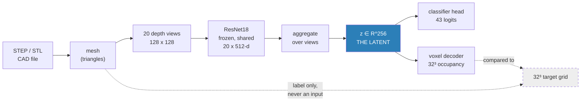
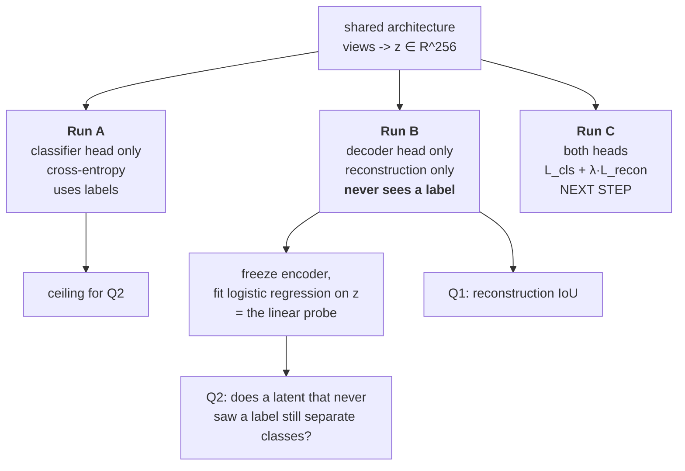

# Multi View Autoencoder

## Context

- Can a multiview encoder compress a 3D part into a latent vector and still give the geometry back when we decode it? 
- If it can, is that same latent good enough to classify the part? 
- And does training it to do both at once make either one better?

That setup lets me ask three separate things:

| | questions we are trying to answer | answered by |
|---|---|---|
| **Q1** | can we rebuild the 3D object from multiview images, and how well | Reconstruction IoU + the view sweep |
| **Q2** | can we classify parts from that same latent | Run B linear probe, with Run A as the ceiling |
| **Q3** | does training both jointly help either one | Run C vs Run A (Phase 2, not run yet) |




Observations:

1. Both heads read only the latent space `z` → classifier and decoder share `z` as input.
2. STEP file to Mesh → A STEP file is a B-rep (analytic surfaces) → not possible to feed convolution → we can render and query a mesh
3. Decoder outputs a 32³ voxel grid → chosen because it runs faster than querying a mesh
4. Voxelization choice: an exact voxelization output empty ofr almost all of thin plates and brackets, had to over-thick walls to fix this issue
5. Example: IoU at 0.55. Either the views genuinely do not contain the geometry OR decoder is too small, OR the latent too narrow, OR the voxel targets are misaligned, OR there is a bug in the loss. To rule out a problem with the decoder we memorising 20 grids with 7 M parameters and then eval on the 20 views → if IoU 1.0000 → all good


## 2. Multiview input

The input is 20 grayscale depth images of the part, 128 x 128. Brighter = closer to the camera. The network has to reconstruct 3D geometry from these.


### Resolution of the Voxel Grid

Fair challenge, so I measured it instead of arguing it.

First the framing: since the grid is a label and not an input, voxelizing does not remove
information from the pipeline. It sets a ceiling on what the measurement can resolve, and
that ceiling applies identically to the prediction and the ground truth. It caps the
resolution of the answer, it does not bias the comparison.

Second, the size of that ceiling:

| resolution | cell size | on a 100 mm part | silhouette IoU vs the true mesh |
|---|---|---|---|
| **32³** | 0.0625 | **3.1 mm** | 0.890 |
| 64³ | 0.0312 | 1.6 mm | 0.941 |
| 128³ | 0.0156 | 0.8 mm | 0.966 |

Third, the question that actually matters for us, which is whether internal features survive.
I probed the axis of a bored annulus across bore sizes:

| bore diameter | on a 100 mm part | cells across | 32³ |
|---|---|---|---|
| 0.103 | 6 mm | 1.6 | **open** |
| 0.171 | 10 mm | 2.7 | **open** |
| 0.343 | 20 mm | 5.5 | **open** |
| 0.772 | 45 mm | 12.3 | **open** |

**So: 32³ resolves bores down to about 6 mm on a 100 mm part.** The internal geometry the
occlusion argument is about is measurable. Threads, chamfers and fillets under about 3 mm
are not. That is the exact scope of what our numbers can support, and I would rather state
it up front than have it asked.


## 5. The encoder

The backbone is ResNet18, ImageNet-pretrained, and frozen (to be able to train on ). 

- Trainable parameter count: **0.14 M** for the classifier arm (aggregator plus heads only,
because the backbone is frozen), **6.97 M** once the decoder is attached.

```
input   feats [B, 20, 512]        20 views, each already a 512-d ResNet18 vector
          |
          |  aggregate over the view axis      <- max-pool (MVCNN) or attention (GMViT-lite)
          v
        [B, 512]
          |
          |  Linear(512 -> 256)
          v
        [B, 256] the latent z
```

## 6. The decoder

```
        [B, 256] the latent z
          |
          |  Linear(256 -> 256*4*4*4), reshape
          v
        [B, 256, 4, 4, 4]
          |  ConvTranspose3d + BatchNorm + ReLU     ->  [B, 128,  8,  8,  8]
          |  ConvTranspose3d + BatchNorm + ReLU     ->  [B,  64, 16, 16, 16]
          |  ConvTranspose3d                        ->  [B,   1, 32, 32, 32]
          v
   occupancy LOGITS [B, 32, 32, 32]
```

Simple architecture taken from 3D-R2N2 / Pix2Vox decoder shape from 2016 and 2019. 

Problems encountered:
1. Model converges to a beautifully falling loss and a completely empty output. Solved by 


## 7. How the experiment is set up

Three runs. Same architecture in all three. They differ only in which heads exist and which
losses run, which is what makes the comparison mean anything.




## 9. Results

All numbers below are CADNET, 2127 parts, 43 classes, 1694 train / 433 test, duplicate-aware split, seed 0.

### 9.1 Accuracy results

| run | trained accuracy | linear probe on z | reconstruction IoU |
|---|---|---|---|
| **A** classifier only | **91.0%** | 89.8% | n/a |
| **B** autoencoder only, *never saw a label* | n/a | **88.2%** | **0.743** |
| C joint | Phase 2, not run | | |
| *1-NN retrieval baseline* | *91.0%* | | |

**Q1 is answered: held-out IoU 0.743 from 20 depth views**, with the gate at 1.0000 to prove
that is the projection's limit and not the decoder's.

**Q2 is answered: a latent trained purely to reconstruct, which has never seen a single
label, probes at 88.2%, which is 2.8 points behind the fully supervised one.** That lands on
the side that supports Sai's framing.

The 1-NN row is a baseline I am showing rather than hiding. Frozen ImageNet features plus
max-pooling are already near-separable for these 43 classes, and a trained linear head adds
almost nothing on top. That sharpens what Q2 is really asking.

#### Accuracy is not hiding a broken class

Accuracy here is plain top-1: take the argmax over the 43 logits, count the matches, divide by
433 test parts. On a 43-way problem that is worth checking against per-class metrics, so:

| Run A, 433 test parts | precision | recall | F1 |
|---|---|---|---|
| **macro** (every class counts equally) | 91.3 | 90.4 | **90.3** |
| **weighted** (by class size) | 91.8 | 91.0 | 90.9 |

Top-1 accuracy 91.0%, balanced accuracy 90.4%.

Macro-F1 sits 0.7 points below accuracy, which is the answer to the class-imbalance question.
The 50-per-class cap leaves the test set near balanced (5 to 13 parts per class, mean 10.1),
no class has zero test parts, and no class scores F1 = 0.

#### Per class, sorted worst first

| class | precision | recall | F1 | test parts |
|---|---|---|---|---|
| **Bracket_like_Parts** | 50.0 | 40.0 | **44.4** | 5 |
| **Bolt_Like_Parts** | 83.3 | 50.0 | **62.5** | 10 |
| **Thin_Plates** | 85.7 | 54.5 | **66.7** | 11 |
| **Slender_Thin_Plates** | 61.5 | 80.0 | **69.6** | 10 |
| **Screw** | 64.3 | 90.0 | **75.0** | 10 |
| Rectangular_Housings | 80.0 | 80.0 | 80.0 | 10 |
| Machined_Blocks | 71.4 | 100.0 | 83.3 | 10 |
| Container_Like_Parts | 88.9 | 80.0 | 84.2 | 10 |
| Long_Machine_Elements | 88.9 | 80.0 | 84.2 | 10 |
| Discs | 81.8 | 90.0 | 85.7 | 10 |
| Thick_Plates | 81.8 | 90.0 | 85.7 | 10 |
| Long_Pins | 83.3 | 90.9 | 87.0 | 11 |
| Contoured_Surfaces | 100.0 | 80.0 | 88.9 | 10 |
| Round_Change_At_End | 100.0 | 80.0 | 88.9 | 10 |
| Bearing_Like_Parts | 90.0 | 90.0 | 90.0 | 10 |
| Curved_Housings | 100.0 | 81.8 | 90.0 | 11 |
| Posts | 90.0 | 90.0 | 90.0 | 10 |
| Slender_Links | 90.0 | 90.0 | 90.0 | 10 |
| Flange_Like_Parts | 83.3 | 100.0 | 90.9 | 10 |
| Machined_Plates | 83.3 | 100.0 | 90.9 | 10 |
| Gear_like_Parts | 100.0 | 90.0 | 94.7 | 10 |
| L_Blocks | 100.0 | 90.0 | 94.7 | 10 |
| Non-90_degree_elbows | 100.0 | 90.0 | 94.7 | 10 |
| Spoked_Wheels | 100.0 | 90.0 | 94.7 | 10 |
| 90_degree_elbows | 90.9 | 100.0 | 95.2 | 10 |
| Handles | 90.9 | 100.0 | 95.2 | 10 |
| Simple_Pipes | 100.0 | 90.9 | 95.2 | 11 |
| Bearing_Blocks | 91.7 | 100.0 | 95.7 | 11 |
| Rocker_Arms | 92.9 | 100.0 | 96.3 | 13 |
| BackDoors | 100.0 | 100.0 | 100.0 | 10 |
| Clips | 100.0 | 100.0 | 100.0 | 10 |
| Contact_Switches | 100.0 | 100.0 | 100.0 | 10 |
| Cylindrical_Parts | 100.0 | 100.0 | 100.0 | 10 |
| Intersecting_Pipes | 100.0 | 100.0 | 100.0 | 10 |
| Motor_Bodies | 100.0 | 100.0 | 100.0 | 10 |
| Nuts | 100.0 | 100.0 | 100.0 | 10 |
| Oil_Pans | 100.0 | 100.0 | 100.0 | 10 |
| Prismatic_Stock | 100.0 | 100.0 | 100.0 | 10 |
| Pulley_Like_Parts | 100.0 | 100.0 | 100.0 | 10 |
| Small_Machined_Blocks | 100.0 | 100.0 | 100.0 | 10 |
| Springs | 100.0 | 100.0 | 100.0 | 10 |
| T-shaped_parts | 100.0 | 100.0 | 100.0 | 10 |
| U-shaped_parts | 100.0 | 100.0 | 100.0 | 10 |

Bold marks F1 below 80. Five classes are perfect on all three metrics.

Two things I would point at rather than wait to be asked:

**Bracket_like_Parts is the worst class on both objectives at once.** F1 44.4 here, and IoU
0.293 in the reconstruction. The same class failing independently in classification and in
geometry is a stronger signal than either number on its own.

**The largest single confusion is Bolt_Like_Parts predicted as Screw, 5 times, which is half
of all Bolt errors.** The precision and recall split shows the direction: Bolt has recall 50.0
against precision 83.3, Screw has recall 90.0 against precision 64.3, so the model is dumping
bolts into the Screw bucket. Accuracy alone cannot show that. It also connects to the
normalization finding in section 11: a bolt and a screw differ largely in thread pitch and
head geometry, at a scale we destroy when we normalize every part into the unit sphere.

The remaining confusions are 2 parts each and all geometrically sensible: Thin_Plates as
Machined_Plates, Curved_Housings as Rectangular_Housings, Contoured_Surfaces as
Slender_Thin_Plates.

### 9.2 View sweep: do the two curves flatten in the same place?


No, and that gap is the whole story. Classification climbs and then saturates.
Reconstruction is flat from the start.

Single-seed curves were not trustworthy enough to say that, so I re-ran with 5 seeds per
point:


| | measurement |
|---|---|
| classification, 1 to 6 views | **+5.1 points**, then saturates. 6 / 12 / 20 are indistinguishable |
| classification seed noise | ±1.2 points |
| reconstruction, 1 to 20 views | **-0.0062 IoU** |
| reconstruction seed noise | ±0.0099 IoU |
| **effect / noise for reconstruction** | **0.63x. the effect is smaller than the noise** |

The apparent dip at 20 views in the single-seed curve was a low draw, not an effect. That is
why the seed repeats exist.

### 9.3 Latent sweep: is the bottleneck the bottleneck?


| latent size | reconstruction IoU |
|---|---|
| 64 | 0.725 |
| 256 | 0.692 |
| 1024 | 0.705 |

16x more capacity, and it is flat and non-monotonic. 64 beats 1024. **The bottleneck is not
the latent. It is upstream, in the 2D projection.** Capacity cannot recover geometry that no
camera ever saw.

### 9.4 The headline

Put those two together:

> **Reconstruction IoU responds to neither view count nor latent size, yet the same
> architecture hits IoU 1.0000 when asked to memorise 20 parts.**
>
> **A single view reconstructs as well as twenty. You cannot triangulate from one view.**

So the decoder is not doing multi-view geometric integration. It is doing **category-level
shape completion**. It recognises "this is a flange" and emits a plausible flange.

That is a materially different claim from "the latent contains the geometry", and it is the
thing I would want said out loud in the meeting.

The probe numbers agree with this reading. As views go from 1 to 12, Run B's probe accuracy
climbs 82.9% to 89.1% while its IoU stays flat. **Extra views add class information without
adding geometric information.**

*Original, reconstruction, error (red = missed, green = added), and an internal cross-section.*

- internal and external boundaries have reconstruction problems


### 9.6 The occlusion premise, tested rather than assumed

The original argument was that multiview loses internal geometry because cameras cannot see
inside. I tested that directly by marking a surface voxel visible if it survives the z-buffer
of at least one of the 20 cameras:

| | |
|---|---|
| surface occluded from **all 20** views | **0.2%** |
| error on visible surface | 20.4% |
| error on occluded surface | 25.3% (1.24x worse) |

**With 20 dodecahedral views, almost nothing on these parts is invisible.** Through-holes and
open pockets get seen from some angle. So 0.743 is not an occlusion limit.

Where the error does live, by depth into the material:

```
  depth from outer surface       error rate
  1 cell   (the boundary)   ####################  19.3%
  3 cells                   #####                  4.6%
  6 cells                   .                      0.0%

  surface voxels overall    #####################  20.4%
  interior voxels overall   ##########              9.6%
```

**Error lives at boundaries, not "inside".** My own first read of the error plot was that
error concentrates at internal features, and that was half wrong: the red ring around a bore
*is* a boundary, and bore walls are visible from some angle.

Two caveats I would state rather than bury. This is measured at 32³, where sub-cell features
do not exist to be occluded. And CADNET has very few genuinely *enclosed* cavities, which is
the real occlusion case. A part with a sealed internal void would probably behave differently.

### 9.7 Which parts reconstruct badly, and why


| best | IoU | | worst | IoU |
|---|---|---|---|---|
| Motor_Bodies | 0.967 | | Bracket_like_Parts | 0.293 |
| Nuts | 0.960 | | U-shaped_parts | 0.357 |
| Machined_Plates | 0.942 | | Thin_Plates | 0.446 |
| Flange_Like_Parts | 0.891 | | 90_degree_elbows | 0.463 |

There is a clean pattern:


Correlation between class thinness and IoU is **-0.529**. Chunky half averages 0.810, thin
half 0.667.

The obvious objection is that IoU is just intrinsically harsher on thin shapes, since a
one-voxel shift destroys a thin plate's overlap while barely touching a solid block. I
controlled for that. Partial correlation is **-0.499**. Metric harshness explains almost none
of it. **Thin parts genuinely reconstruct worse.**

### 9.8 One thing we caught before reporting it

The first Run A came back at 92.9% with a 94.1% probe. Those numbers were not real.

I checked because 76% after a single epoch was suspiciously fast:

| check | random split | duplicate-aware split |
|---|---|---|
| parts sharing an identical 32³ grid | **17.5%** | |
| test parts with a train neighbour at cosine > 0.999 | **17.9%** | 1.4% |
| **1-nearest-neighbour accuracy** | **95.5%** | 91.0% |
| Run A accuracy | 92.9% | **91.0%** |
| linear probe | 94.1% | **89.8%** |

The decisive signal was that 1-NN retrieval scored **higher than the trained model**. When a
trivial retrieval baseline beats the model, the task is no longer classification. It is
"find the copy you already saw". The worst offenders sit at cosine 1.0000.

CADNET contains **19.3% duplicates** (411 of 2127 parts, 1716 distinct groups). The training
code now builds duplicate groups as connected components and assigns whole groups to one side
of the split.

Inspecting the original pre-normalization bounding boxes of 220 duplicate groups: **86% are
true duplicates**, the same part shipped twice under different filenames. The other **14% are
scale variants** that our own normalization collapsed. One group spans a 1000x size ratio.

That second finding is worth raising on its own, see section 11.

This mattered more for Q1 than for Q2. An inflated accuracy is embarrassing. An inflated
reconstruction IoU would have been reported as evidence about what the projection preserves,
which is exactly the failure mode this project was designed to avoid.

---

## 10. If you remember three things

1. **The latent is not invertible in the geometric sense.** IoU 0.743, and it does not move
   when you give it 20x more views or 16x more capacity. The decoder is recognising
   categories and completing shapes, not integrating geometry across views.
2. **But the latent is very good for classification.** 88.2% from a representation that never
   saw a label, against 91.0% supervised. If the downstream task is classification, dedup or
   retrieval, this pipeline is already in good shape.
3. **Error is at boundaries, and thin parts are where it hurts.** Not occlusion (only 0.2% of
   surface is invisible to all 20 views), and not the bottleneck size. Thin geometry is the
   real weakness, and Bracket_like_Parts at 0.293 is the concrete example.

---

## 11. What can be improved

### Immediate, this week

| | what | cost | why |
|---|---|---|---|
| 1 | **latency benchmark**, `bench.py` | 5 min | makes "GPU or CPU" answerable from our own numbers instead of a quoted paper. Times rendering and the frozen ResNet18 too, which the cache hides but deployment cannot |
| 2 | **STEP demo end to end** on the real C-Infinity file | half a day, has risk | needs `cadquery-ocp` installed. The file is AP242 with 37 solids, so it is an assembly and the demo loops over parts. Fallback is converting to STL by hand |
| 3 | **Run C**, joint training | a few hours | answers Q3. Only worth starting once 1 and 2 are clean |

### The real technical improvements, in order of how much I think they would move the number

**Go to 64³, and expect the number to get worse.** That degradation is the finding, not a
regression. At 32³ we cannot see sub-3mm features, so part of 0.743 is the grid and not the
projection. 64³ costs 3.2x per step and 829 MB of cache.

**Swap the voxel decoder for an occupancy MLP.** `f(z, point) -> inside / outside`, queried
against the mesh live. It is resolution free, so one trained model evaluates at 32³ or 128³
with no retraining, and it removes the over-thick target caveat entirely. The decoder already
sits behind an interface so this is a one-class swap. I originally scoped this as a stretch
goal; now that fast exact containment is built it is a genuine option.

**Unfreeze the backbone.** We are currently asking ImageNet features to describe untextured
depth maps of machined parts, which is a domain they have never seen. This costs accuracy in
a way we have not measured. It is not free: it removes the feature cache and every run gets
much more expensive.

**Do something about thin parts specifically.** They are 45% of the average part by our own
thinness measure, they are the worst reconstruction cases, and 6.2% of parts only exist in
the dataset at all because of dilation. Higher resolution is the blunt fix. A signed distance
field target instead of binary occupancy is the sharper one.

**More views is not on this list, and that is a result.** Beyond 6 views, classification
saturates and reconstruction never responded at all. If anyone proposes 40 views as an
improvement, we have measured that it will not help.

### Data, and this is the part I would want C-Infinity to think about

**CADNET is 19.3% duplicates.** A random split over duplicated parts inflated every one of
our metrics, and 1-NN scored 95.5% before we fixed it. Whether internal part data has the
same property is a question worth asking, because if it does, every accuracy number anyone
has reported on it is optimistic.

**Normalization destroys absolute scale.** We scale every part into the unit sphere, so an M6
and an M8 bolt become literally the same input. 14% of our duplicate groups are pure scale
variants. That is the invariance conflict showing up in our own pipeline: a classifier
*wants* those two to look identical, dedup needs them not to. It is also exactly the
good-recall/bad-precision signature we already have a problem with elsewhere.

### Known gaps I would flag rather than let someone find

- Reported IoU is against a target roughly 15% over-thick by construction, so no claim of the
  form "reconstructed volume equals true volume" is available.
- Run B seed repeats stopped at epoch 30 on low battery. The comparison is apples-to-apples
  at fixed epoch and the verdict will not change, but the noise floor would tighten with a
  full 60-epoch rerun.
- There is no single number for "the projection costs exactly X IoU". Attribution here is
  qualitative: I can say which stage the bottleneck is in, not price it. A voxel-to-voxel
  autoencoder would give the hard figure, but it takes 3D as input, which is out of scope by
  design.
- MCB (58k and 18k parts) is downloaded and sitting on disk, unused. CADNET's watertightness
  was good enough that the fallback never triggered.

---

## 12. What I need decided

1. **Is the deployment target GPU or CPU?** Every latency number is meaningless without it,
   and after step 1 above I will have latency numbers.
2. **Are voxels the right decode target,** or does C-Infinity have a view given the
   differentiable rendering work already in-house?
3. **Which downstream tasks are meant to share one latent?** Classification, dedup and
   registration want different invariances. That is a conflict of objectives, not a tuning
   problem.
4. **Internal labelled part data, or public data for now?** This decides whether week 2 is
   "reproduce GMViT as a baseline" or "build our own labelled set".
5. **Does internal data have CADNET's duplicate problem?** See section 11.
6. **Does absolute scale need to survive the encoder?** See section 11.

---

## Appendix A: what everything cost

| artifact | one-time cost | size |
|---|---|---|
| CADNET download, 3317 STL, 43 classes | minutes | 195 MB |
| feature + voxel cache, 2127 parts, 0 skipped | **33 min** | 35 MB |
| Run A (classifier, on cached features) | **6 seconds** | |
| Run B (autoencoder, 120 epochs) | 34 min | |
| overfit gate | 10 min | |
| view sweep + latent sweep, 13 runs | 2 h | |
| seed repeats, 36 runs | overnight | |

The 33-minute cache is the single decision that made the week work. Everything after it reads
a 35 MB array.

Two dependencies that are not optional: `embreex` makes exact point-in-solid testing
**380x faster** (0.02 s per part instead of 7.63 s, which is 40 seconds instead of 4 hours
across the dataset), and `cadquery-ocp` is needed only for reading STEP directly.

## Appendix B: reproducing any of this

```bash
conda activate mvae
cd /Users/rebecca.cervasio/Downloads/papers/project/mvae

python src/smoke_mps.py                      # does ConvTranspose3d work here
python src/mesh.py <mesh>                    # one part: normalize, gate, voxelize, plot
python src/render.py <mesh>                  # the 20 depth views as a grid
python src/cache.py --dataset cadnet --limit 50   # the 33-minute cache, once
python src/train.py --run A --name A         # classifier
python src/train.py --run B --overfit 20 --epochs 200 --name gate   # THE GATE
python src/train.py --run B --name B         # autoencoder
python src/sweep.py all                      # sweeps and plots 1 and 3
python src/recon_viz.py results/ckpt_B.pt --n 4   # plot 2

python src/viz.py <mesh> --voxels            # interactive: mesh next to voxels
python src/viz.py <mesh> --cameras           # the 20 viewpoints, in place
python src/voxcompare.py <mesh>              # exact vs conservative, true outline in red
```

Every plot regenerates from the saved JSON in seconds with `python src/sweep.py plot` and
`python src/table.py --png`. Nothing needs retraining.

Full implementer's log, including every measurement bug caught along the way, is in
`NOTES.md`. Current state and next commands are in `RESUME.md`.

| | what we used | why we chose it |
|---|---|---|
| **dataset** | CADNET, 43 classes, capped at 50 parts per class = 2127 parts | real mechanical CAD |
| **split** | duplicate-aware, 1694 train / 433 test | CADNET is 19.3% duplicates. a random split leaks them and inflates every metric |
| **CAD to mesh** | tessellate with OCP / trimesh, watertight gate, 0 parts skipped | a B-rep has no fixed size or ordering, so a network cannot eat it. the mesh is what we can both render and query for containment |
| **input** | 20 orthographic depth maps, 128 x 128, cameras on a regular dodecahedron | depth carries geometry, RGB would only carry a lighting choice we invented. dodecahedron gives even angular coverage with no preferred axis. renderer written from scratch in numpy/torch, no pyrender or OSMesa |
| **encoder backbone** | ResNet18, ImageNet-pretrained, **frozen**, 512-d per view | same backbone GMViT uses. freezing lets us cache every per-view feature once (33 min), so a training run reads a 35 MB array and Run A trains in 6 seconds. that is what paid for the sweeps |
| **aggregation** | max-pool over views (MVCNN) or 1-query attention pool (GMViT-lite), ~40 lines | max-pool is the zero-parameter control arm. writing 5 lines we can explain beats making a research repo run |
| **latent** | `z ∈ R^256`, `Linear(512 -> 256)` | this is the number under test. if the latent were the bottleneck, 64 / 256 / 1024 should differ. it does not |
| **decoder** | `Linear` to 256 x 4³, then 3 x `ConvTranspose3d` + BatchNorm + ReLU, 6.97 M params | deliberately the standard 3D-R2N2 / Pix2Vox shape. a novel decoder would make the result impossible to attribute |
| **target** | 32³ conservative voxel grid | the format is dictated by what the decoder can emit (voxel grid is simpler for derivation) |
| **loss** | `BCEWithLogits`, `pos_weight = 11.1` | tricky to avoid empty reconstruction |
| **metric** | reconstruction IoU, plus a linear probe on frozen `z` | Loss can decrease for an empty reconstruction, IoU does not |
| **the gate** | memorise 20 parts, train and eval on the same 20 | tells "the views lost the geometry" apart from "my decoder is broken". we got **IoU 1.0000**, so 0.743 held out is a real limit |
| **runs** | A = classifier only, B = autoencoder only (no labels at all), C = joint | identical architecture in all three, only the heads and losses change. that is what makes the comparison mean anything |
